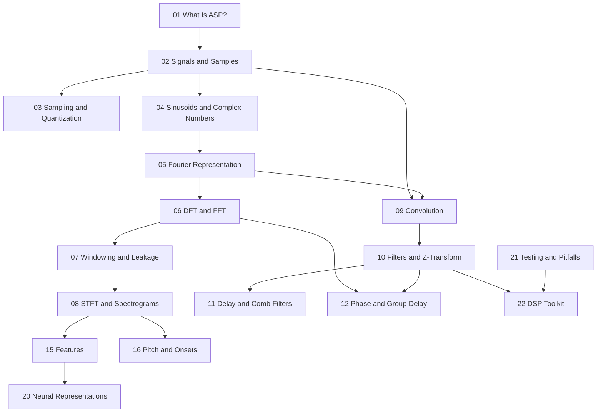

# Book Plan: Audio Signal Representation and Processing

## Book Thesis

This book teaches audio signal representation and processing from first principles to practical implementation. The central claim is that **audio is not a single representation**—it is a family of related mathematical objects (samples, spectra, impulse responses, features, synthesis parameters) linked by well-defined transforms and approximations. A practitioner who understands those links can implement algorithms correctly, interpret measurements, read the research literature, and debug real systems.

## Target Audience

Technically strong programmers, researchers, and engineers who:

- Can read mathematics and code comfortably
- Want depth beyond tutorial-level explanations
- Need to implement, measure, or integrate audio DSP in production or research settings

Prerequisites assumed: basic calculus, complex numbers, linear algebra at an introductory level, and programming experience (Python examples throughout).

## Chapter List and Status

| # | File | Title | Status | Depends On |
|---|------|-------|--------|------------|
| 00 | `00-preface.md` | Preface | draft | — |
| 01 | `01-what-is-audio-signal-processing.md` | What Is Audio Signal Processing? | draft | 00 |
| 02 | `02-signals-time-and-samples.md` | Signals, Time, and Samples | stub | 01 |
| 03 | `03-sampling-quantization-and-digital-audio.md` | Sampling, Quantization, and Digital Audio | stub | 02 |
| 04 | `04-sinusoidal-signals-and-complex-numbers.md` | Sinusoidal Signals and Complex Numbers | stub | 02 |
| 05 | `05-fourier-representation.md` | Fourier Representation | stub | 04 |
| 06 | `06-dft-fft-and-spectral-analysis.md` | DFT, FFT, and Spectral Analysis | stub | 05 |
| 07 | `07-windowing-leakage-and-resolution.md` | Windowing, Leakage, and Resolution | stub | 06 |
| 08 | `08-stft-spectrograms-and-time-frequency-analysis.md` | STFT, Spectrograms, and Time–Frequency Analysis | stub | 07 |
| 09 | `09-convolution-and-impulse-responses.md` | Convolution and Impulse Responses | stub | 02, 05 |
| 10 | `10-filters-fir-iir-and-z-transform.md` | Filters: FIR, IIR, and the Z-Transform | stub | 09 |
| 11 | `11-delay-lines-comb-filters-and-allpass-filters.md` | Delay Lines, Comb Filters, and All-Pass Filters | stub | 10 |
| 12 | `12-phase-group-delay-and-minimum-phase.md` | Phase, Group Delay, and Minimum Phase | stub | 06, 10 |
| 13 | `13-envelopes-loudness-and-dynamics.md` | Envelopes, Loudness, and Dynamics | stub | 02 |
| 14 | `14-resampling-interpolation-and-sample-rate-conversion.md` | Resampling, Interpolation, and Sample-Rate Conversion | stub | 03, 10 |
| 15 | `15-audio-features-and-descriptors.md` | Audio Features and Descriptors | stub | 08 |
| 16 | `16-pitch-onsets-and-rhythm.md` | Pitch, Onsets, and Rhythm | stub | 06, 08 |
| 17 | `17-musical-signal-representations.md` | Musical Signal Representations | stub | 04, 08 |
| 18 | `18-synthesis-representations.md` | Synthesis Representations | stub | 04, 10 |
| 19 | `19-physical-modeling-representations.md` | Physical-Modeling Representations | stub | 09, 18 |
| 20 | `20-neural-audio-representations.md` | Neural Audio Representations | stub | 08, 15 |
| 21 | `21-testing-measurement-and-numerical-pitfalls.md` | Testing, Measurement, and Numerical Pitfalls | stub | 06, 10 |
| 22 | `22-building-a-small-audio-dsp-toolkit.md` | Building a Small Audio DSP Toolkit | stub | 10, 21 |

**Status legend:** `stub` = outline or placeholder only; `draft` = substantive prose, may need review; `reviewed` = checked for correctness and consistency; `polished` = ready for publication-quality pass.

## Learning Objectives by Chapter

### Chapter 00 — Preface

- Understand scope, prerequisites, and how to use the book
- Know how notation, glossary, examples, and builds are organized

### Chapter 01 — What Is Audio Signal Processing?

By the end of this chapter, the reader should be able to:

1. Distinguish **physical sound**, **analog signals**, and **digital representations**
2. Name the main representation domains used in audio DSP (time, frequency, time–frequency, parametric)
3. Explain why multiple representations exist and when each is appropriate
4. Identify common confusions (amplitude vs. magnitude, Hz vs. bin index, continuous vs. discrete time)
5. Outline the pipeline from acoustic event to processed output in a typical system

### Chapter 02 — Signals, Time, and Samples (planned)

- Define continuous-time and discrete-time signals
- Relate sample index, sample period, and sample rate
- Interpret PCM buffers and normalization conventions

### Chapter 03 — Sampling, Quantization, and Digital Audio (planned)

- State the sampling theorem and explain aliasing
- Model uniform quantization and dynamic range tradeoffs
- Describe common audio file formats and metadata at a practical level

*(Chapters 04–22: detailed objectives to be added as each chapter is drafted.)*

## Dependencies Between Chapters

## Missing Sections (Highest Priority)

1. **Chapter 02** — Formal definitions of signals; PCM as sequences; amplitude units
2. **Chapter 03** — Sampling theorem, anti-aliasing, quantization noise
3. **Examples directory** — Executable demos referenced from early chapters
4. **Figures** — Representation-domain diagram, sample-rate timeline, A440 sine wave
5. **Cross-references** — Pandoc labels once more chapters exist
6. **Exercises with solutions** — Worked solutions appendix (future)

## Current Sprint Focus

**Completed this pass:** repository scaffold, planning documents, preface, Chapter 01 draft.

**Next recommended step:** Draft **Chapter 02 (Signals, Time, and Samples)** with a worked A440 example, one executable script (`examples/a440_sine_wave.py`), and a figure showing discrete samples of a sinusoid.

## Conventions

- Notation: see `NOTATION.md`
- Terms: see `GLOSSARY.md`
- Open issues: see `REVIEW_NOTES.md`
- Build: `make html` / `make pdf` / `make epub` from `book/`
