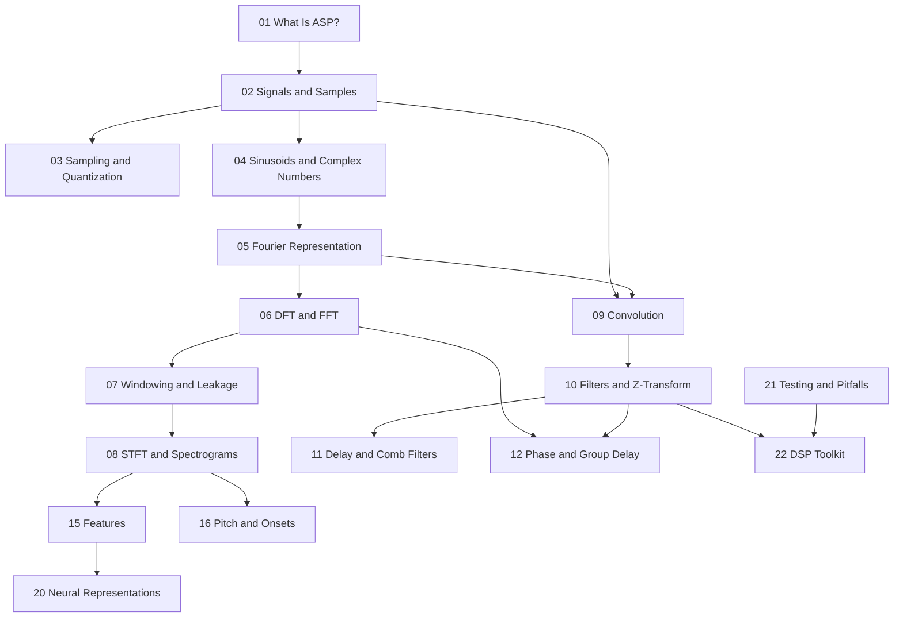

# Book Plan: Audio Signal Representation and Processing

## Book Thesis

This book teaches audio signal representation and processing from first principles to practical implementation. The central claim is that **audio is not a single representation**—it is a family of related mathematical objects (samples, spectra, impulse responses, features, synthesis parameters) linked by well-defined transforms and approximations. A practitioner who understands those links can implement algorithms correctly, interpret measurements, read the research literature, and debug real systems.

## Target Audience

Technically strong programmers, researchers, and engineers who:

- Can read mathematics and code comfortably
- Want depth beyond tutorial-level explanations
- Need to implement, measure, or integrate audio DSP in production or research settings

Prerequisites assumed: basic calculus, complex numbers, linear algebra at an introductory level, and programming experience (Python examples throughout).

## Chapter List and Status

| # | File | Title | Status | Depends On |
|---|------|-------|--------|------------|
| 00 | `00-preface.md` | Preface | reviewed | — |
| 01 | `01-what-is-audio-signal-processing.md` | What Is Audio Signal Processing? | reviewed | 00 |
| 02 | `02-signals-time-and-samples.md` | Signals, Time, and Samples | reviewed | 01 |
| 03 | `03-sampling-quantization-and-digital-audio.md` | Sampling, Quantization, and Digital Audio | reviewed | 02 |
| 04 | `04-sinusoidal-signals-and-complex-numbers.md` | Sinusoidal Signals and Complex Numbers | reviewed | 02 |
| 05 | `05-fourier-representation.md` | Fourier Representation | reviewed | 04 |
| 06 | `06-dft-fft-and-spectral-analysis.md` | DFT, FFT, and Spectral Analysis | reviewed | 05 |
| 07 | `07-windowing-leakage-and-resolution.md` | Windowing, Leakage, and Resolution | reviewed | 06 |
| 08 | `08-stft-spectrograms-and-time-frequency-analysis.md` | STFT, Spectrograms, and Time–Frequency Analysis | reviewed | 07 |
| 09 | `09-convolution-and-impulse-responses.md` | Convolution and Impulse Responses | reviewed | 02, 05 |
| 10 | `10-filters-fir-iir-and-z-transform.md` | Filters: FIR, IIR, and the Z-Transform | reviewed | 09 |
| 11 | `11-delay-lines-comb-filters-and-allpass-filters.md` | Delay Lines, Comb Filters, and All-Pass Filters | reviewed | 10 |
| 12 | `12-phase-group-delay-and-minimum-phase.md` | Phase, Group Delay, and Minimum Phase | reviewed | 06, 10 |
| 13 | `13-envelopes-loudness-and-dynamics.md` | Envelopes, Loudness, and Dynamics | reviewed | 02 |
| 14 | `14-resampling-interpolation-and-sample-rate-conversion.md` | Resampling, Interpolation, and Sample-Rate Conversion | reviewed | 03, 10 |
| 15 | `15-audio-features-and-descriptors.md` | Audio Features and Descriptors | reviewed | 08 |
| 16 | `16-pitch-onsets-and-rhythm.md` | Pitch, Onsets, and Rhythm | reviewed | 06, 08 |
| 17 | `17-musical-signal-representations.md` | Musical Signal Representations | reviewed | 04, 08 |
| 18 | `18-synthesis-representations.md` | Synthesis Representations | draft | 04, 10 |
| 19 | `19-physical-modeling-representations.md` | Physical-Modeling Representations | draft | 09, 18 |
| 20 | `20-neural-audio-representations.md` | Neural Audio Representations | draft | 08, 15 |
| 21 | `21-testing-measurement-and-numerical-pitfalls.md` | Testing, Measurement, and Numerical Pitfalls | draft | 06, 10 |
| 22 | `22-building-a-small-audio-dsp-toolkit.md` | Building a Small Audio DSP Toolkit | draft | 10, 21 |

**Status legend:** `stub` = outline or placeholder only; `draft` = substantive prose, may need review; `reviewed` = checked for correctness and consistency; `polished` = ready for publication-quality pass.

## Learning Objectives by Chapter

### Chapter 00 — Preface

- Understand scope, prerequisites, and how to use the book
- Know how notation, glossary, examples, and builds are organized

### Chapter 01 — What Is Audio Signal Processing?

By the end of this chapter, the reader should be able to:

1. Distinguish **physical sound**, **analog signals**, and **digital representations**
2. Name the main representation domains used in audio DSP (time, frequency, time–frequency, parametric)
3. Explain why multiple representations exist and when each is appropriate
4. Identify common confusions (amplitude vs. magnitude, Hz vs. bin index, continuous vs. discrete time)
5. Outline the pipeline from acoustic event to processed output in a typical system

### Chapter 02 — Signals, Time, and Samples

By the end of this chapter, the reader should be able to:

1. Define continuous-time and discrete-time signals and convert index to time
2. Compute duration, sample period, and sinusoidal period in samples
3. Interpret PCM buffers and mono/stereo layout conventions
4. Distinguish linear amplitude, integer PCM, and dBFS
5. Generate a discrete sinusoid with correct phase continuity across blocks

### Chapter 03 — Sampling, Quantization, and Digital Audio

By the end of this chapter, the reader should be able to:

1. State the Nyquist–Shannon condition and compute aliased frequencies
2. Model uniform quantization and estimate SQNR vs. bit depth
3. Explain anti-aliasing and reconstruction in a capture/playback chain
4. Interpret WAV/PCM parameters and estimate uncompressed storage
5. Recognize aliasing sources beyond ADCs (nonlinearities, naive oscillators)

### Chapter 04 — Sinusoidal Signals and Complex Numbers

By the end of this chapter, the reader should be able to:

1. Convert between cosine and complex exponential forms of sinusoids
2. Apply Euler's formula and interpret phasor rotation in the complex plane
3. Compute magnitude and phase of complex samples with correct units (radians)
4. Explain conjugate symmetry for real signals using counter-rotating phasors
5. Implement $Ae^{j(\Omega n + \phi)}$ and extract real audio with NumPy

### Chapter 05 — Fourier Representation

By the end of this chapter, the reader should be able to:

1. Explain orthogonality of complex exponentials and read Fourier series coefficients
2. Contrast Fourier series, Fourier transform, DTFT, and DFT scope
3. Interpret magnitude and phase of transform values without unit confusion
4. Predict how truncating a series (partial sums) affects wave shape and timbre
5. Connect harmonic decay (e.g. $1/k$ for square waves) to brightness in synthesis

### Chapter 06 — DFT, FFT, and Spectral Analysis

By the end of this chapter, the reader should be able to:

1. Write the DFT/IDFT and map bin index $k$ to center frequency $f_k = k f_s/N$
2. Interpret $|X[k]|$ and $\angle X[k]$ for real audio segments
3. Apply conjugate symmetry and use `rfft` efficiently
4. Explain FFT as an algorithm, not a different transform
5. Recognize off-bin tones, leakage preview, and zero-padding interpolation

### Chapter 07 — Windowing, Leakage, and Resolution

1. Apply windows before DFT; relate leakage to finite segments
2. Trade main-lobe width vs sidelobes (rect, Hann, Hamming, Blackman)
3. Correct spectra for coherent gain; choose windows for tonal vs transient goals

### Chapter 08 — STFT and Spectrograms

1. Define STFT with $M$, $R$, $w[n]$; plot spectrograms
2. Explain time–frequency tradeoffs; overlap and COLA preview
3. Select STFT parameters for speech, music, transients

### Chapter 09 — Convolution and Impulse Responses

1. Compute discrete convolution; interpret IR of LTI systems
2. Relate time convolution to frequency multiplication
3. Recognize circular vs linear convolution; overlap-add concept

### Chapter 10 — Filters, FIR, IIR, Z-Transform

1. Write FIR/IIR difference equations and $H(z)$
2. Plot $|H(\Omega)|$ and assess stability (poles inside unit circle)
3. Design windowed-sinc FIR lowpass; choose FIR vs IIR

### Chapter 11 — Delay, Comb, All-Pass

1. Implement delay lines; fractional delay preview
2. Analyze feedforward/feedback combs; stable feedback gains
3. Use all-pass for diffusion; sketch Schroeder reverb

### Chapter 12 — Phase and Group Delay

1. Unwrap phase; compute group delay
2. Contrast linear-phase, minimum-phase, mixed-phase filters
3. Relate pre-ringing and dispersion to filter choice

### Chapter 13 — Envelopes, Loudness, Dynamics

1. Compute peak, RMS, envelope followers
2. Distinguish dBFS, SPL, LUFS (conceptual)
3. Sketch compressor/limiter behavior

### Chapter 14 — Resampling and SRC

1. Upsample/downsample with anti-imaging/anti-alias filtering
2. Explain rational and arbitrary SRC at high level
3. Avoid decimation without low-pass

### Chapter 15 — Audio Features

1. Compute centroid, rolloff, flux, ZCR
2. Outline MFCC pipeline (Mel + DCT)
3. Document STFT params with published features

### Chapter 16 — Pitch, Onsets, Rhythm

1. Estimate $f_0$ via autocorrelation; refine DFT peaks
2. Detect onsets from spectral flux
3. Outline tempo estimation via periodicity of onset strength

### Chapter 17 — Musical Representations

1. Sinusoidal partial models; harmonic series
2. Build chroma; contrast STFT vs CQT
3. Know limits of sinusoidal models on transients/noise

### Chapter 18 — Synthesis Representations

1. Wavetable/phase accumulator; additive/subtractive/FM/granular overview
2. Anti-alias discontinuities (BLEP/oversampling)
3. Match synthesis paradigm to timbre/control needs

### Chapter 19 — Physical Modeling

1. Excitation–resonator–radiation pipeline
2. Waveguide and modal models; stability/tuning issues
3. Relate to delays, filters, nonlinear excitation

### Chapter 20 — Neural Audio Representations

1. Compare waveform, spectrogram, latent domains
2. Differentiable STFT; neural codec embeddings
3. Identify phase/domain-shift pitfalls in ML pipelines

### Chapter 21 — Testing and Pitfalls

1. Unit tests: impulse, sine, Parseval, round-trip FFT/STFT
2. Measure THD+N, frequency response; true-peak awareness
3. Mitigate denormals, limit cycles, intersample clipping

### Chapter 22 — DSP Toolkit Capstone

1. Modular toolkit layout (io, osc, spectral, filters, effects, meter)
2. End-to-end WAV pipeline with tests
3. Extend one component with documented $f_s$ conventions

## Dependencies Between Chapters

## Missing Sections (Polish Pass)

1. **Review pass** — promote chapters 18–22 from `draft` → `reviewed` (00–17 done through Pass 10)
2. **Pandoc cross-refs** — replace remaining plain "Chapter N" in chapters 18–22
3. **Exercise solutions** — appendix (future)
4. **Pandoc build CI** — `make html` when Pandoc available on runner
5. **Chapter depth** — optional expansion of 19–20 in teaching pass

## Current Sprint Focus

**Completed (Pass 10, 2026-07-03):** Editorial review of chapters 13–17; `@sec:` IDs on Ch 13–22 (IDs added for forward refs); cross-links across production/analysis block; GLOSSARY (chroma, crest factor, MFCC, spectral centroid, flux); chapters 13–17 promoted to **reviewed**.

**Next recommended step (Pass 11):** Editorial review of **chapters 18–22** (synthesis, physical modeling, neural, testing, toolkit); complete cross-ref pass; promote final chapters to `reviewed`; consider Pandoc HTML build in CI.

## Conventions

- Notation: see `NOTATION.md`
- Terms: see `GLOSSARY.md`
- Open issues: see `REVIEW_NOTES.md`
- Build: `make html` / `make pdf` / `make epub` from `book/`
