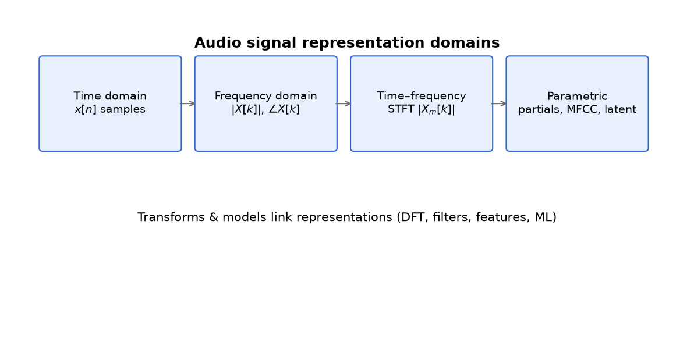

# What Is Audio Signal Processing? {#ch-01-what-is-asp}

## Purpose

This chapter establishes the scope of audio signal processing (ASP): what we mean by "audio," which **representations** we use to work with it digitally, and why those representations coexist. The goal is a map of the territory before we define samples, spectra, and filters in detail.

If you leave with one idea, let it be this: **digital audio is not "the sound"—it is one convenient representation of sound**, and processing means moving between representations under constraints (sample rate, bit depth, latency, causality, and numerical error).

## Learning Objectives

By the end of this chapter, the reader should be able to:

1. Distinguish **physical acoustics**, **analog electrical signals**, and **digital sequences**
2. Name the major representation domains: time, frequency, time–frequency, and parametric
3. Explain why ASP uses multiple representations and select an appropriate one for a given task
4. Identify common category errors (amplitude vs. magnitude, Hz vs. bin index, continuous vs. discrete time)
5. Sketch a typical digital audio pipeline from transduction to output

## Main Concepts

### Sound, signals, and data

**Sound** is a physical phenomenon: pressure variations propagating in a medium. A **microphone** converts pressure (or a related acoustic quantity) into an **analog signal**—a continuous-time voltage $x(t)$ proportional to acoustic pressure over a useful frequency range.

**Digital audio** is obtained by **sampling** and **quantization**: we record a sequence $x[n]$ at discrete times $nT_s$ with finite-precision amplitudes. From that point onward, most algorithms operate on arrays in memory—PCM buffers, spectral frames, feature vectors—not on air pressure.

This distinction matters for correctness. A peak-normalized waveform plot shows numbers in $[-1, 1]$; a concert hall measures sound level in pascals or decibels SPL. Both are legitimate, but they answer different questions.

### What "processing" means

**Audio signal processing** transforms representations to achieve a goal:

| Goal | Example | Typical representation |
|------|---------|------------------------|
| Analysis | Pitch tracking, onset detection | STFT, autocorrelation, learned embeddings |
| Transformation | EQ, compression, reverb | Time domain or frequency domain |
| Synthesis | Oscillators, physical models | Samples, wavetables, modal parameters |
| Coding | Storage and streaming | Compressed codes (MDCT coefficients, etc.) |
| Measurement | Loudness metering, QA tests | Filters + energy sums, perceptual weighting |

Processing can be **linear** (convolution, filtering) or **nonlinear** (compressors, clipping, neural networks). It can be **causal** (real-time effects) or **non-causal** (offline mastering, batch analysis).

### Representation domains

ASP rarely stays in one domain. The main ones:

1. **Time domain** — $x[n]$ as amplitude vs. sample index. Natural for waveforms, delay, sample-by-sample nonlinearities.
2. **Frequency domain** — Magnitude and phase vs. frequency. Natural for tonal content, filter design, some equalization.
3. **Time–frequency domain** — Spectra evolving over time (STFT, constant-Q transform). Natural for speech, music, transients.
4. **Parametric / model domain** — Small sets of interpretable parameters (sinusoidal partials, FM indices, modal resonances). Natural for synthesis and compact descriptions.

No domain is "the truth." Each is a **view** with resolution tradeoffs. [Chapter 8](#ch-08-stft) develops time–frequency tradeoffs explicitly; for now, remember that choosing a view is part of the problem definition.



### Linear time-invariant systems as a backbone

Much of classical ASP rests on **linear time-invariant (LTI)** systems: the output is the convolution of the input with an **impulse response** $h[n]$, and the same rule applies at every time index. Filters, reverberation models, and equalizers often start here—even when the full system is later made nonlinear.

We defer the mathematics of convolution to [Chapter 9](#ch-09-convolution), but the architectural picture is useful immediately: **impulse response ↔ frequency response ↔ difference equation** are linked descriptions of the same LTI system [@oppenheim2010discrete].

### A typical digital pipeline

A simplified real-time chain:

```text
Acoustic source → Microphone → ADC → x[n] → DSP → y[n] → DAC → Speaker → Air
```

Between $x[n]$ and $y[n]$ you might find:

- **Buffering** for block-based FFT processing
- **Resampling** if subsystems disagree on $f_s$
- **Filtering** (EQ, crossover networks)
- **Dynamics processing** (gain riding, compression)
- **Effects** (delay networks, reverberators)

Offline chains (analysis, mastering, ML dataset creation) may use non-causal windows, look-ahead, and higher-precision intermediates. The representation choices differ even when the underlying math is similar.

## Mathematical Formulation

At this introductory level, we only fix vocabulary.

- **Continuous-time signal:** $x(t)$, real or complex, $t \in \mathbb{R}$
- **Discrete-time signal:** $x[n]$, $n \in \mathbb{Z}$ or a finite index set
- **Sample rate:** $f_s$ samples per second; sample period $T_s = 1/f_s$

A digital PCM buffer of length $N$ is the vector $(x[0], x[1], \ldots, x[N-1])$. Duration in seconds is $T = N / f_s$.

We have not yet defined the DFT, but when we do, a crucial relationship will appear: for an $N$-point DFT at sample rate $f_s$, **bin spacing** is

$$
\Delta f = \frac{f_s}{N}.
$$

Many "off-by-one frequency" bugs are explained by forgetting $\Delta f$ depends on both $f_s$ and analysis length $N$.

## Audio Interpretation

Consider **A440**: a sinusoid at $f = 440\,\mathrm{Hz}$. At $f_s = 48000\,\mathrm{Hz}$, one period spans about $48000/440 \approx 109$ samples—not an integer. A finite recording therefore never contains an exact integer number of periods unless you trim or detune carefully.

That single fact connects time and frequency views:

- In **time**, we see a nearly periodic waveform.
- In **frequency**, a finite analysis smears energy across bins (**spectral leakage**) unless we window or align periods.

Another audio-grounded example: a **snare drum hit** is short in time and broadband in frequency. A long FFT tuned for harmonic resolution will blur the transient in time; a short FFT resolves the hit in time but poorly resolves low-frequency harmonics elsewhere in the mix. Representation choice is constrained by the **time–frequency tradeoff** [@allen1977unified].

## Implementation Notes

Practical systems encode conventions you must know to interoperate:

- **Sample rates:** Common rates include 44100 Hz (CD-era), 48000 Hz (video/pro audio), and 96000 Hz (high-resolution production). Algorithms must declare which $f_s$ they assume.
- **Channel layout:** Mono is $x[n]$; stereo is $x_L[n], x_R[n]$ or interleaved buffers. Multichannel arrays add an axis; convolutions may be per-channel or coupled (MIMO filters).
- **Normalization:** Floating-point WAV often uses $[-1, 1]$ nominal full scale; integer PCM uses fixed ranges (e.g., 16-bit signed). **dBFS** is relative to digital full scale, not acoustic SPL.
- **Latency:** Real-time block processing introduces delay in samples; resampling and linear-phase filters add group delay. Measurement and UX depend on accounting for this.

When reading library documentation (NumPy, SciPy, librosa, JUCE, etc.), identify which representation the API expects: samples vs. frames vs. normalized spectrum.

## Worked Example

**Problem:** A buffer contains $N = 4800$ samples at $f_s = 48000\,\mathrm{Hz}$. What is the duration? If we later take a 1024-point DFT of a segment from this buffer, what is the bin spacing?

**Duration:**

$$
T = \frac{N}{f_s} = \frac{4800}{48000} = 0.1\,\mathrm{s} = 100\,\mathrm{ms}.
$$

**Bin spacing** (for a 1024-point DFT at the same $f_s$):

$$
\Delta f = \frac{f_s}{1024} = \frac{48000}{1024} \approx 46.875\,\mathrm{Hz}.
$$

The bin nearest 440 Hz is $k = \mathrm{round}(440 / \Delta f) \approx 9$, corresponding to center frequency $9 \cdot \Delta f \approx 421.875\,\mathrm{Hz}$—not exactly A440. A naive "pick the peak bin" pitch estimate will be biased unless we interpolate or use a longer transform/window.

This example previews why [DFT, FFT, and Spectral Analysis](#ch-06-dft-fft) treats bin grids carefully rather than treating FFT output as a continuous spectrum. [Signals, Time, and Samples](#ch-02-signals-time-samples) defines sample index, duration, and discrete sinusoids in detail.

## Common Pitfalls

1. **Confusing amplitude and magnitude.** Sample values $x[n]$ are amplitudes in time. $|X[k]|$ is spectral magnitude. Squaring magnitude relates to power in that bin context—not to peak waveform level without Parseval-aware reasoning.

2. **Ignoring sample rate.** A normalized digital frequency $\Omega = 2\pi f / f_s$ depends on $f_s$. The same analog corner frequency maps to different digital filter coefficients when $f_s$ changes.

3. **Treating FFT bins as arbitrary Hz grids.** Bin center frequencies depend on $N$ and $f_s$. Interpolation (parabolic peak picking, phase vocoder refinements) is often required for fine frequency estimates [@muller2015fundamentals].

4. **Forgetting phase.** Magnitude-only processing can destroy transients or cause synthesis artifacts when inverse transforms are implicit (e.g., Griffin–Lim-style procedures). Phase matters in filtering, concatenative synthesis, and coherent measurement.

5. **Continuous vs. discrete notation slip.** $x(t)$ vs. $x[n]$ is not cosmetic. Derivatives become differences; integrals become sums; stability moves to the unit circle in $z$.

## Exercises

1. A stereo file runs at $f_s = 44100\,\mathrm{Hz}$ for 3 minutes. How many samples per channel?
2. Name one task better suited to time-domain processing and one better suited to frequency-domain processing. Justify in one paragraph each.
3. For $f_s = 48000\,\mathrm{Hz}$ and $N = 2048$, compute $\Delta f$. Which bin index is closest to 1000 Hz?
4. Explain in your own words why a snare transient challenges pure sinusoidal modeling.
5. Sketch (on paper) a block diagram of a product you use (DAW plugin, speech recognizer, synthesizer) and label where you believe buffers, FFTs, and parameter sets appear.

## Further Reading

- Julius O. Smith, *Physical Audio Signal Processing* — intuitive bridges between physical and digital views [@smith2010physical]
- Oppenheim & Schafer, *Discrete-Time Signal Processing* — precise LTI and representation foundations [@oppenheim2010discrete]
- Curtis Roads, *The Computer Music Tutorial* — broad perspective on representations in computer music [@roads1996computer]
- Meinard Müller, *Fundamentals of Music Processing* — analysis representations with audio examples [@muller2015fundamentals]

**Next chapter:** [Signals, Time, and Samples](#ch-02-signals-time-samples) defines discrete-time signals, units, and PCM conventions that underpin everything else.
