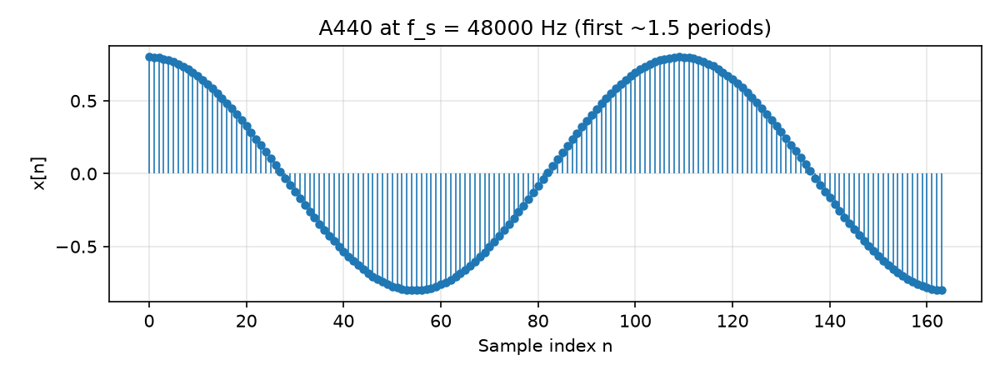

# Signals, Time, and Samples {#ch-02-signals-time-samples}

## Purpose

[Chapter 1](#ch-01-what-is-asp) mapped the landscape of audio signal processing. This chapter makes the **time-domain representation** precise: what a discrete-time signal is, how sample index relates to seconds, and how PCM buffers encode amplitude. Nearly every algorithm in the book reads or writes sequences $x[n]$; getting this layer right prevents unit errors that propagate silently through filters, FFTs, and feature extractors.

## Learning Objectives

By the end of this chapter, the reader should be able to:

1. Define **continuous-time** and **discrete-time** signals and convert between sample index and time in seconds
2. Compute **duration**, **sample period**, and **period in samples** for a sinusoid at a given $f_s$
3. Interpret **PCM buffers** (mono/stereo, interleaved vs. planar layouts at a conceptual level)
4. Distinguish **linear amplitude**, **integer PCM codes**, and **dBFS** level
5. Generate a correct discrete sinusoid in code and recognize when phase continuity matters across buffers

## Main Concepts

### Continuous time vs. discrete time

A **continuous-time signal** is a function $x(t)$ where $t$ is real-valued time, usually in seconds. Analog hardware and physical acoustics are modeled this way before digitization.

A **discrete-time signal** is a sequence $x[n]$ where $n$ is an **integer sample index**. We often visualize $x[n]$ as a stem plot or line plot with dots at integer $n$; the value between indices is undefined unless we explicitly reconstruct or interpolate ([Chapter 14](#ch-14-resampling)).

Sampling ([Chapter 3](#ch-03-sampling-quantization)) explains how $x[n]$ relates to $x(t)$. For now, treat $x[n]$ as the object your program manipulates.

### Sample rate, sample period, and duration

The **sample rate** $f_s$ is the number of samples per second (hertz). The **sample period** is

$$
T_s = \frac{1}{f_s}.
$$

Sample $x[n]$ is associated with the time instant

$$
t_n = n\,T_s = \frac{n}{f_s}.
$$

For a buffer of length $N$ starting at $n = 0$, the covered time interval is $[0,\, (N-1)T_s]$ if we attribute each sample to its sampling instant; the **duration** is often approximated as

$$
T = \frac{N}{f_s},
$$

which equals the interval length from the first sample time to one sample past the last— a common off-by-one convention in audio tooling. Always check whether a library uses $N/f_s$ or $(N-1)/f_s$ when converting frames to milliseconds.

### PCM as sequences

**Pulse-code modulation (PCM)** stores audio as uniformly spaced samples with quantized amplitudes. In memory, PCM is typically:

- A **1-D array** $x[n]$ for mono
- **Two arrays** $x_L[n], x_R[n]$ (*planar*), or one **interleaved** array $[\ldots, x_L[n], x_R[n], \ldots]$

Sample rate and bit depth metadata describe how to interpret raw bytes; the mathematical signal remains a sequence indexed by $n$.

### Amplitude and units

Three amplitude contexts appear constantly:

| Context | Typical range | Meaning |
|---------|---------------|---------|
| Floating-point PCM | $[-1, 1]$ nominal | Linear **full-scale fraction**; 1.0 is digital full scale before clipping |
| Fixed-point PCM | e.g. 16-bit signed | Integer codes proportional to pressure/voltage at ADC |
| Physical acoustics | pascals, dB SPL | Sound in air; requires calibration from digital to acoustic |

**dBFS** (decibels relative to full scale) measures level relative to digital full scale:

$$
L_{\mathrm{dBFS}} = 20\log_{10}\left(\frac{|x|_{\mathrm{peak}}}{1.0}\right)
$$

for amplitude ratios against full scale. Thus $0\,\mathrm{dBFS}$ is peak at full scale; $-6\,\mathrm{dBFS}$ is roughly half peak amplitude. dBFS describes the **digital representation**, not loudness in a room ([Chapter 13](#ch-13-envelopes-loudness)).

### Discrete sinusoids

A real sinusoid at frequency $f_0$ Hz and sample rate $f_s$ is

$$
x[n] = A\cos\left(2\pi f_0 \frac{n}{f_s} + \phi\right),
$$

with peak amplitude $A$ and initial phase $\phi$ in radians. The **period in seconds** is $1/f_0$; the **period in samples** is

$$
P = \frac{f_s}{f_0}.
$$

Unless $P$ is an integer, the discrete sequence is **not exactly periodic** over any finite block whose length is an integer number of "visual cycles." That matters for spectral analysis ([Chapter 6](#ch-06-dft-fft)) and for seamless looping.

### Multichannel and block processing

Real systems process **frames**: contiguous blocks of $N$ samples for vectorized FFT, GPU kernels, or network packets. A frame index $b$ (block index) relates to sample time via

$$
n = bN + i,\quad i \in \{0,\ldots,N-1\}.
$$

Latency, overlap-add, and streaming all depend on tracking both **global sample index** and **block boundaries**.

## Mathematical Formulation

**Definition (discrete-time signal).** A discrete-time signal is a sequence $x[n]$ defined for $n$ in a subset of $\mathbb{Z}$ (often $n \ge 0$ or $0 \le n < N$).

**Definition (sinusoid).** For sample rate $f_s > 0$,

$$
x[n] = A\cos(\Omega n + \phi),\qquad \Omega = 2\pi \frac{f_0}{f_s}.
$$

Here $\Omega$ is **normalized angular frequency** in radians per sample (see `NOTATION.md`).

**Root mean square (preview).** For a finite segment,

$$
\mathrm{RMS} = \sqrt{\frac{1}{N}\sum_{n=0}^{N-1} x[n]^2}.
$$

For a full-scale sine, $\mathrm{RMS} = A/\sqrt{2}$; in dBFS, $20\log_{10}(A/\sqrt{2})$.

## Audio Interpretation

**A440** at $f_s = 48000\,\mathrm{Hz}$ has period $P = 48000/440 \approx 109.09$ samples. You never get an exact closed cycle in a finite integer-length buffer unless you choose $f_0$, $f_s$, and $N$ jointly.

A **piano note** decaying over seconds is still $x[n]$— amplitude changes slowly compared to $T_s$, but the signal remains a single sequence. Envelope and loudness are layered on top of oscillation ([Chapter 13](#ch-13-envelopes-loudness)).

A **room impulse response** is also a sequence: pressure samples after an impulsive excitation. Long IRs (hundreds of milliseconds) require large $N$ at high $f_s$; memory and CPU scale linearly with $N$ for naive convolution ([Chapter 9](#ch-09-convolution)).

## Implementation Notes

### NumPy arrays as $x[n]$

In Python, store $x[n]$ as a 1-D `float64` or `float32` array. Use **explicit** $f_s$ variables; do not infer rate from array length alone.

```python
import numpy as np

fs = 48_000
f0 = 440.0
n = np.arange(N)
x = A * np.cos(2 * np.pi * f0 * n / fs + phi)
```

**Phase continuity:** When generating audio in blocks, carry phase forward:

```python
phase = 2 * np.pi * f0 * n_start / fs + phi
x = A * np.cos(phase + 2 * np.pi * f0 * np.arange(block_size) / fs)
```

Naive `np.cos(2*np.pi*f0*n/fs)` with a reset `n` each block causes **phase discontinuities** (clicks) at block edges.

### Integer PCM

16-bit signed PCM uses codes in $[-32768, 32767]$. Conversion to float $[-1, 1]$ is typically `x_float = x_int / 32768.0` (watch for off-by-one conventions in specific codecs). Quantization error is analyzed in [Chapter 3](#ch-03-sampling-quantization).

### Executable example

The script `examples/a440_sine_wave.py` generates a short A440 segment, prints period and dBFS level, and writes a stem plot:



Run from `book/`:

```bash
python examples/a440_sine_wave.py
```

## Worked Example

**Problem:** Generate A440 at $f_s = 48000\,\mathrm{Hz}$ with peak amplitude $A = 0.8$. Find (a) $T_s$, (b) period in samples, (c) RMS level in dBFS for a long sinusoid segment.

**(a) Sample period:**

$$
T_s = \frac{1}{48000} \approx 20.833\,\mu\mathrm{s}.
$$

**(b) Period in samples:**

$$
P = \frac{48000}{440} \approx 109.09\ \text{samples per cycle}.
$$

**(c) RMS and dBFS:**

$$
\mathrm{RMS} = \frac{0.8}{\sqrt{2}} \approx 0.566,\qquad
L_{\mathrm{dBFS}} = 20\log_{10}(0.566) \approx -4.94\,\mathrm{dBFS}.
$$

Peak level is $20\log_{10}(0.8) \approx -1.94\,\mathrm{dBFS}$. Peak and RMS levels answer different metering questions— do not interchange them.

## Common Pitfalls

1. **Confusing index with time.** $n$ is dimensionless; multiply by $T_s$ for seconds. Bugs appear when code treats `n` as milliseconds.

2. **Hard-coded sample rates.** Filters, delay lines, and oscillator increment all depend on $f_s$. A coefficient set tuned at 44100 Hz is wrong at 48000 Hz without redesign.

3. **Assuming exact periodicity.** $x[n] = \cos(2\pi n/10)$ is periodic with period 10; A440 at 48 kHz is not periodic with a short integer period.

4. **Peak vs. RMS vs. spectral magnitude.** Peak sample value, RMS level, and FFT bin magnitude are related but not identical. Meters and features must declare which they use.

5. **dBFS vs. dB SPL.** Digital headroom is not acoustic loudness. SPL requires calibration through the entire capture/reproduction chain.

6. **Block boundary clicks.** Resetting phase or truncating a waveform without zero-cross alignment causes audible discontinuities.

## Exercises

1. At $f_s = 44100\,\mathrm{Hz}$, how many samples span exactly 50 ms? Is the answer an integer?
2. Derive $\Omega$ for $f_0 = 1000\,\mathrm{Hz}$ at $f_s = 48000\,\mathrm{Hz}$. Express $\Omega$ in radians per sample.
3. A peak-normalized float sine peaks at $-3\,\mathrm{dBFS}$. What is its peak amplitude $A$?
4. Modify `a440_sine_wave.py` to plot two cycles using the smallest integer $N$ that spans at least two cycles (use $\lceil 2P \rceil$). Listen (optional): write the buffer to WAV and check for seam clicks when looping.
5. Stereo interleaved buffer has length 96000 samples at $f_s = 48000\,\mathrm{Hz}$. How many samples per channel and what duration?

*Selected solutions: [Appendix — Exercise Solutions](#ch-23-exercise-solutions).*

## Further Reading

- Oppenheim & Schafer, *Discrete-Time Signal Processing* — formal sequences, sampling notation [@oppenheim2010discrete]
- Julius O. Smith, *Physical Audio Signal Processing* — practical digital audio conventions [@smith2010physical]
- Lyons, *Understanding Digital Signal Processing* — intuitive discrete-time signals [@lyons2011understanding]

**Next chapter:** [Sampling, Quantization, and Digital Audio](#ch-03-sampling-quantization) connects $x(t)$ to $x[n]$ and explains aliasing and bit depth.
