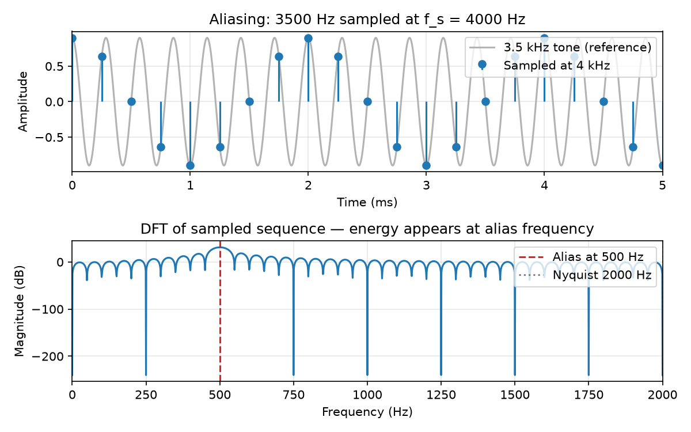
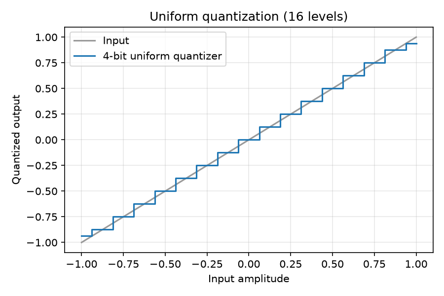

# Sampling, Quantization, and Digital Audio

## Purpose

Chapter 2 treated discrete sequences $x[n]$ as given. This chapter explains how they arise from **sampling** a continuous-time signal and how **quantization** maps each sample to a finite-precision code. Together, sampling and quantization define the fidelity limits of digital audio: bandwidth (aliasing) and noise floor (quantization). Every ADC, WAV file, and naive oscillator passes through these mechanisms— explicitly or implicitly.

## Learning Objectives

By the end of this chapter, the reader should be able to:

1. State the **Nyquist–Shannon sampling condition** for band-limited signals
2. Compute **aliased frequencies** when content exceeds the Nyquist limit
3. Model **uniform quantization** and estimate signal-to-quantization-noise ratio vs. bit depth
4. Describe the practical roles of **anti-aliasing filters** and **reconstruction**
5. Read basic **PCM/WAV** parameters (sample rate, bit depth, channels) and predict storage implications

## Main Concepts

### From analog to digital

The idealized chain:

```text
x(t)  →  [anti-aliasing LPF]  →  sampler  →  x[n]  →  quantizer  →  digital codes
```

**Sampling** picks $x[n] = x(nT_s)$ at period $T_s = 1/f_s$. **Quantization** maps each sample to one of a finite set of levels (Chapter 2 introduced PCM as sequences; here we specify the errors).

Real **ADCs** implement filtering, sampling, and quantization in hardware; floating-point WAV files often store samples that already approximate $x[n]$ as `float32`, but the same aliasing and level-limit concepts apply when those files were created or when algorithms generate new digital content.

### Band-limiting and the sampling theorem

A continuous signal $x(t)$ is **band-limited** to $B$ Hz if its Fourier transform $X(f)$ is zero for $|f| > B$. If $x(t)$ is band-limited to $B$ and we sample at

$$
f_s > 2B,
$$

then $x(t)$ can be recovered exactly from its samples (ideal reconstruction). The threshold $f_s = 2B$ is the **Nyquist rate** for that bandwidth; $f_s/2$ is the **Nyquist frequency** [@shannon1949communication; @oppenheim2010discrete].

Audio is not strictly band-limited— energy exists above 20 kHz in practice— but microphones and anti-aliasing filters constrain bandwidth before the ADC. **Oversampling** (e.g., 48 kHz or 96 kHz) provides guard band above the audible range.

### Aliasing

When energy at frequency $f$ is present with insufficient band-limiting, sampling at rate $f_s$ makes it **indistinguishable** from a component at a lower frequency. For a sinusoid at frequency $f$, the alias in the audible band is

$$
f_a = \left| f - k f_s \right|
$$

for the integer $k$ that places $f_a$ in $[0, f_s/2]$. Equivalently, frequencies fold about $f_s/2$:

$$
f_a = f_s - f \quad \text{when } f_s/2 < f < f_s.
$$

**Example:** A $3500\,\mathrm{Hz}$ tone sampled at $4000\,\mathrm{Hz}$ (Nyquist $2000\,\mathrm{Hz}$) aliases to $500\,\mathrm{Hz}$ because $4000 - 3500 = 500$.

Aliasing is not only an ADC problem. **Nonlinear processing** (waveshaping, clipping, multiplication) creates new partials; **naive digital oscillators** that increase phase faster than $\pi$ radians per sample emit energy above Nyquist and fold down audibly (a classic synthesis bug).

### Anti-aliasing and reconstruction

An **anti-aliasing filter** is a low-pass filter before sampling that attenuates energy above $f_s/2$. Without it, out-of-band content becomes in-band aliases.

**Reconstruction** converts samples back to a continuous waveform— ideally band-limited interpolation (sinc kernel). DACs use hold circuits and analog filtering. **Resampling** (Chapter 14) repeats the band-limit → sample pattern in software.

### Uniform quantization

A **uniform quantizer** with step size $\Delta$ maps continuous amplitude $x$ to

$$
Q(x) = \Delta \left\lfloor \frac{x}{\Delta} + \frac{1}{2} \right\rfloor
$$

(round-to-nearest level). For $B$-bit signed PCM spanning $[-1, 1]$, there are $2^B$ levels and $\Delta = 2/2^B$.

**Quantization error** $e[n] = Q(x[n]) - x[n]$ is often modeled as white noise uncorrelated with the signal (approximation; breaks at very low levels). For a full-scale sinusoid, a standard approximation for **signal-to-quantization-noise ratio (SQNR)** is

$$
\mathrm{SQNR} \approx 6.02 B + 1.76\ \mathrm{dB}.
$$

Each extra bit adds roughly $6\,\mathrm{dB}$ of dynamic range— a useful rule of thumb for 16-bit ($\approx 98\,\mathrm{dB}$), 24-bit, and fixed-point DSP headroom.

**Dither** (small noise before quantization) reduces correlated distortion on low-level signals at the cost of a slightly raised noise floor— common in mastering and image/audio bit-depth reduction.

### Bit depth, formats, and metadata

Common **PCM bit depths**:

| Bits | Typical use | Comment |
|------|-------------|---------|
| 16 | CD, many WAV files | Integer; $\Delta$ fixed |
| 24 | Production audio | More headroom for processing |
| 32 float | DAW internals | Not inherently better unless gain staging is correct |

A minimal **WAV** file stores interleaved PCM samples plus a header: sample rate, bit depth, channel count, and data size. **Compressed formats** (FLAC, MP3, AAC) apply coding on top of or instead of raw PCM [@brandenburg1999mp3]; decoding yields a PCM buffer for DSP.

**Normalization** metadata (peak, LUFS) may accompany files but does not change the meaning of sample values— always read $f_s$ and amplitude convention from context.

## Mathematical Formulation

**Ideal sampling:**

$$
x[n] = x(nT_s), \qquad T_s = \frac{1}{f_s}.
$$

**Alias of a sinusoid** at frequency $f$ when sampling at $f_s$ (ignoring phase):

$$
\cos(2\pi f n T_s) = \cos\left(2\pi (f \bmod f_s)\, n T_s\right),
$$

with the modded frequency taken into $[0, f_s/2]$ by folding.

**Uniform quantizer** on range $[-X_{\max}, X_{\max}]$ with $L$ levels:

$$
\Delta = \frac{2X_{\max}}{L}, \qquad Q(x) = \Delta \,\mathrm{round}(x/\Delta).
$$

**Storage size** (uncompressed PCM, one channel):

$$
\text{bytes} = N \times \frac{B}{8} \times C,
$$

for $N$ samples, $B$ bits per sample, $C$ channels.

## Audio Interpretation

**Vocal vowels** can contain strong harmonics above $10\,\mathrm{kHz}$; a low sample rate without filtering can alias high harmonics **down** into the low mids, coloring timbre unnaturally.

**Hi-hat and snare** energy extends high; cheap recorders with weak anti-aliasing can sound dull **and** alias simultaneously— filtering removes highs, poor design lets aliases remain in band.

**16-bit CD audio** at $44100\,\mathrm{Hz}$ implies Nyquist $22050\,\mathrm{Hz}$ with practical band-limiting near $20\,\mathrm{kHz}$. Quantization noise floor is far below typical listening noise floors in well-mastered material, but **gain staging** during production still matters: processing at float, clipping to integer on export.

## Implementation Notes

### Detecting aliasing in code

When generating a tone at frequency `f0` and sample rate `fs`, verify `f0 < fs/2` (strictly, after band-limiting). For oscillators:

$$
\Delta\phi = 2\pi \frac{f_0}{f_s} \quad \text{must not imply frequencies above Nyquist when waveforms are not pure sinusoids.}
$$

Saw and square waves contain harmonics; band-limited oscillators (BLEP/BLIT methods) exist precisely to avoid aliasing in synthesis (Chapter 18).

### Quantizing in Python

```python
import numpy as np

def uniform_quantize(x, bits, full_scale=1.0):
    levels = 2 ** bits
    delta = 2 * full_scale / levels
    x_clip = np.clip(x, -full_scale, full_scale - 1e-12)
    return delta * np.round(x_clip / delta)
```

Compare peak, RMS, and spectrum before/after quantization when testing bit-depth reduction.

### Executable examples

`examples/aliasing_demo.py` plots a $3500\,\mathrm{Hz}$ tone sampled at $4000\,\mathrm{Hz}$ and a uniform quantizer staircase:





```bash
python examples/aliasing_demo.py
```

## Worked Example

**Problem:** A studio records with $f_s = 48000\,\mathrm{Hz}$ and 24-bit PCM. (a) What is the Nyquist frequency? (b) An unfiltered ultrasonic tone at $30000\,\mathrm{Hz}$ leaks into the ADC— to what frequency does it alias? (c) Rough SQNR for a full-scale sine at 24 bits?

**(a) Nyquist:**

$$
f_{\mathrm{Nyq}} = \frac{48000}{2} = 24000\,\mathrm{Hz}.
$$

**(b) Alias:** $30000 > 24000$, so

$$
f_a = 48000 - 30000 = 18000\,\mathrm{Hz}.
$$

The alias remains below Nyquist and is **audible**— a serious defect.

**(c) SQNR:**

$$
6.02 \times 24 + 1.76 \approx 146\,\mathrm{dB}.
$$

Real converters add analog noise and distortion; the formula is an **ideal uniform quantizer** bound.

**Storage:** 60 seconds mono at 24 bit ($3$ bytes/sample commonly packed) $\approx 48000 \times 3 \times 60 \approx 8.6\,\mathrm{MB}$ plus header— order-of-magnitude check for file sizes.

## Common Pitfalls

1. **Assuming the sample rate alone prevents aliasing.** Without low-pass filtering, content above $f_s/2$ folds in.

2. **Testing tones only at low frequencies.** Aliasing bugs in synthesizers appear when playing high notes— test near Nyquist.

3. **Confusing bit depth with dynamic range in the mix.** 24-bit files help processing headroom; listening level and mastering limiters determine perceived loudness.

4. **Ignoring dither on re-quantization.** Truncating float to 16-bit without dither can create harmonic distortion on quiet tails.

5. **Treating WAV float as "immune" to quantization.** Float avoids uniform PCM steps but ADC/DAC and fixed-point plugins still quantize; denormals and precision limits matter (Chapter 21).

6. **Wrong alias formula sign.** Always reduce to $[0, f_s/2]$; listen and FFT to verify when in doubt.

## Exercises

1. Sample rate $22050\,\mathrm{Hz}$. What frequency aliases with a $12000\,\mathrm{Hz}$ component?
2. How many samples in one second of stereo 16-bit PCM at $44100\,\mathrm{Hz}$? How many bytes (ignoring header)?
3. Derive the number of quantization levels for $B$ bits on $[-1,1]$. What is $\Delta$ for $B=16$?
4. Run `aliasing_demo.py`. Change `f_true` to $1500\,\mathrm{Hz}$ at $f_s=4000\,\mathrm{Hz}$— is aliasing present? Explain.
5. Why does clipping a full-band signal digitally **before** low-pass filtering risk aliasing on subsequent downsampling?

## Further Reading

- Shannon, *Communication in the presence of noise* (sampling theorem foundation) [@shannon1949communication]
- Oppenheim & Schafer, *Discrete-Time Signal Processing* — sampling, reconstruction, quantization [@oppenheim2010discrete]
- Julius O. Smith, *Physical Audio Signal Processing* — practical ADC/audio digitization [@smith2010physical]
- Steiglitz, *A Digital Signal Processing Primer* — accessible sampling and quantization [@steiglitz1996dsp]

**Next chapter:** Chapter 04 — *Sinusoidal Signals and Complex Numbers* develops the complex exponential representation that makes sampling and Fourier analysis algebraically clean.
