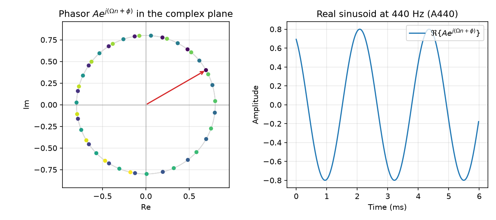

# Sinusoidal Signals and Complex Numbers {#ch-04-sinusoids-complex}

## Purpose

Pure tones and Fourier analysis both revolve around **sinusoids**. Real-valued audio waveforms are
usually stored as real sequences $x[n]$, but the algebra of frequency analysis is far cleaner with
**complex exponentials**. This chapter introduces the complex sinusoid $Ae^{j(\Omega n + \phi)}$,
Euler's formula, and the phasor picture that links amplitude, phase, and rotation in the complex
plane. Mastering this layer makes the DFT ([Chapter 6](#ch-06-dft-fft)) and filter frequency
responses ([Chapter 10](#ch-10-filters)) predictable instead of magical.

## Learning Objectives

By the end of this chapter, the reader should be able to:

1. Write a discrete-time sinusoid in **cosine form** and **complex exponential form**
2. Apply **Euler's formula** to convert between real and complex representations
3. Interpret **magnitude** $|z|$ and **phase** $\angle z$ of a complex sample or spectral value
4. Explain why real audio signals have **conjugate-symmetric** spectra
5. Implement a complex sinusoid in code and extract its real part correctly

## Representation lens

| Question | Complex-sinusoid answer |
|----------|------------------------|
| **What is the representation?** | $Ae^{j(\Omega n + \phi)}$ phasor; real audio is $\Re\{z[n]\}$ |
| **What does it preserve?** | Amplitude $A$, frequency $\Omega$, phase evolution across $n$ |
| **What does it discard?** | Nothing in analysis— real signals discard negative-frequency half in storage |
| **Maps in/out via** | Euler form ↔ cosine; DFT bins ([Chapter 6](#ch-06-dft-fft)); filter $H(e^{j\Omega})$ |
| **Numerical mistakes** | Principal-value phase wraps; mixing degrees and radians |
| **Audible artifacts** | Phase discontinuities at block joins; beating from frequency mismatch |

## Main Concepts

### Real sinusoids

A real discrete-time sinusoid at frequency $f_0$ and sample rate $f_s$ is

$$
x[n] = A\cos(\Omega n + \phi), \qquad \Omega = 2\pi \frac{f_0}{f_s},
$$

with peak amplitude $A$, initial phase $\phi$ (radians), and normalized angular frequency $\Omega$
in **radians per sample** ([Chapter 2](#ch-02-signals-time-samples)).

**Phase** shifts the waveform left or right along the time axis. **Amplitude** scales peak
excursion. **Frequency** sets how many radians of phase accumulate per sample.

### Complex numbers in brief

A complex number $z = a + jb$ can be drawn in the **complex plane** with horizontal axis $\Re\{z\}$
and vertical axis $\Im\{z\}$. Polar form:

$$
z = r e^{j\theta}, \qquad r = |z| = \sqrt{a^2 + b^2}, \qquad \theta = \angle z = \mathrm{atan2}(b,
a).
$$

We use $j$ (not $i$) following electrical-engineering convention in DSP texts
[@oppenheim2010discrete; @lyons2011understanding].

### Euler's formula

Euler's formula connects rotation to sinusoids:

$$
e^{j\theta} = \cos\theta + j\sin\theta.
$$

Consequences used constantly:

$$
\cos\theta = \Re\{e^{j\theta}\}, \qquad \sin\theta = \Im\{e^{j\theta}\}.
$$

Multiplying by $e^{j\theta}$ **rotates** a phasor by $\theta$ in the complex plane.

### The complex sinusoid

Define the **complex sinusoid**

$$
z[n] = A e^{j(\Omega n + \phi)}.
$$

Its real part is the cosine wave we hear:

$$
x[n] = \Re\{z[n]\} = A\cos(\Omega n + \phi).
$$

The imaginary part is a sine with the same frequency and amplitude:

$$
\Im\{z[n]\} = A\sin(\Omega n + \phi).
$$

**Phasor intuition:** At each $n$, the point $z[n]$ lies on a circle of radius $A$. As $n$
increases, the phasor rotates at $\Omega$ radians per sample. The real audio sample is the
**projection** of that phasor onto the real axis.



### Magnitude and phase of a sample

For any complex value (sample or spectrum bin):

$$
|z| = \sqrt{(\Re z)^2 + (\Im z)^2}, \qquad \angle z = \mathrm{atan2}(\Im z, \Re z).
$$

For $z[n] = A e^{j(\Omega n + \phi)}$, magnitude is constant $|z[n]| = A$ and phase increases
linearly: $\angle z[n] = \Omega n + \phi$ (modulo $2\pi$ when reporting principal values).

**Do not confuse** $|x[n]|$ (absolute value of a real sample) with spectral magnitude $|X[k]|$
([Chapter 6](#ch-06-dft-fft))— same notation shape, different objects.

### Negative frequency as clockwise rotation

Positive $\Omega$ rotates counterclockwise. The sequence $e^{-j\Omega n}$ rotates clockwise— in
Fourier analysis this corresponds to the **negative frequency** component needed to represent real
signals.

A real sinusoid can be written as a sum of two counter-rotating phasors:

$$
A\cos(\Omega n + \phi) = \frac{A}{2} e^{j(\Omega n + \phi)} + \frac{A}{2} e^{-j(\Omega n + \phi)}.
$$

This **conjugate symmetry** ($X[k] = X^*[N-k]$ for real $x[n]$) is foundational for efficient real-
input FFTs and for interpreting one-sided spectra.

### Why complex representations matter for audio

1. **Fourier analysis** projects signals onto complex exponentials $e^{-j\Omega n}$; magnitude and
phase fall out naturally.
2. **Filters** are often designed in terms of $H(e^{j\Omega})$— complex gain vs. frequency.
3. **Analytic signals** (Hilbert transform, [Chapter 12](#ch-12-phase-group-delay) preview) use
$x_a[n] = x[n] + j\mathcal{H}\{x\}[n]$ to isolate positive frequencies for envelopes and phase
vocoders.
4. **Modulation** (AM, PM, FM) is multiplication and exponentiation of phasors ([Chapter
18](#ch-18-synthesis)).

Audio remains **real on output**; complex values are an internal coordinate system.

## Mathematical Formulation

**Complex exponential sequence:**

$$
e^{j\Omega n} = \cos(\Omega n) + j\sin(\Omega n).
$$

**General complex sinusoid:**

$$
z[n] = A e^{j(\Omega n + \phi)} = A\bigl[\cos(\Omega n + \phi) + j\sin(\Omega n + \phi)\bigr].
$$

**Product of phasors (frequency addition):**

$$
e^{j\Omega_1 n} \cdot e^{j\Omega_2 n} = e^{j(\Omega_1 + \Omega_2)n}.
$$

Multiplication in time as phasor addition underlies ring modulation and many synthesis patches.

**Conjugate:**

$$
z^* = A e^{-j(\Omega n + \phi)} \quad \Rightarrow \quad \Re\{z^*\} = A\cos(\Omega n + \phi).
$$

## Audio Interpretation

**A440** with $A=0.8$, $\phi=0$ is a piano tuning reference— symmetric about zero, repeating every
$\approx 109$ samples at $48\,\mathrm{kHz}$ ([Chapter 2](#ch-02-signals-time-samples)). Adding $\phi
= \pi/2$ turns a cosine into a sine (same timbre, different phase; identical magnitude spectrum).

**Detuned pairs** at $440\,\mathrm{Hz}$ and $441\,\mathrm{Hz}$ beat because their phasors rotate at
nearly equal rates but slip relative phase— perceived as slow amplitude modulation. Phase
relationships between partials determine **timbre** in harmonic sounds.

## Implementation Notes

### NumPy complex sinusoid

```python
import numpy as np

fs = 48_000
f0 = 440.0
A = 0.8
phi = np.pi / 6
n = np.arange(N)
Omega = 2 * np.pi * f0 / fs

z = A * np.exp(1j * (Omega * n + phi))  # complex
x = np.real(z)                           # real audio
# x = A * np.cos(Omega * n + phi)       # equivalent
```

Use `np.exp(1j * ...)` or `np.cos`/`np.sin` for real output— not both inconsistently in the same
pipeline.

### Phase unwrapping

`np.angle` returns principal values in $(-\pi, \pi]$. For plots of phase vs. time or vs. frequency,
use `np.unwrap` to remove artificial $2\pi$ jumps.

### Executable example

`examples/complex_sinusoid_demo.py` plots the phasor trajectory and real part for A440:

```bash
python examples/complex_sinusoid_demo.py
```

## Worked Example

**Problem:** $f_0 = 1000\,\mathrm{Hz}$, $f_s = 48000\,\mathrm{Hz}$, $A = 1$, $\phi = \pi/4$. Find
(a) $\Omega$, (b) $z[0]$, (c) $x[5]$.

**(a)**

$$
\Omega = 2\pi \frac{1000}{48000} = \frac{\pi}{24} \approx 0.1309\ \text{rad/sample}.
$$

**(b)**

$$
z[0] = e^{j\pi/4} = \cos(\pi/4) + j\sin(\pi/4) = \frac{\sqrt{2}}{2} + j\frac{\sqrt{2}}{2}.
$$

Magnitude $1$, phase $45^\circ$.

**(c)**

$$
x[5] = \cos\left(5 \cdot \frac{\pi}{24} + \frac{\pi}{4}\right)
= \cos\left(\frac{5\pi + 6\pi}{24}\right)
= \cos\left(\frac{11\pi}{24}\right) \approx -0.7934.
$$

Verify in Python with `np.cos(5*np.pi/24 + np.pi/4)`.

## Common Pitfalls

1. **Radians vs. degrees.** DSP formulas assume radians unless explicitly noted.
`np.cos(np.deg2rad(45))` not `np.cos(45)`.

2. **Using `i` or wrong axis.** Engineering texts use $j$; NumPy uses `1j`. Plot real signals on the
time axis— do not plot $\Im\{z[n]\}$ as "the audio" unless intentional (quadrature channels).

3. **Forgetting conjugate symmetry.** Real $x[n]$ implies spectral bins satisfy $X[k]=X^*[N-k]$;
keeping only magnitudes discards phase information needed for inversion and filtering.

4. **Confusing $|z[n]|$ with $|X[k]|$.** Sample magnitude of a sinusoid can be constant; spectral
magnitude tells energy at a frequency— different domains.

5. **Phase origin ambiguity.** Global phase $\phi$ is often inaudible for isolated tones but matters
when **adding** signals or comparing channels.

6. **Exp notation errors.** `np.exp(1j * Omega * n)` requires the `1j` factor; `np.exp(j * ...)` is
invalid in Python.

## Exercises

1. Express $x[n] = \sin(\Omega n)$ as the imaginary part of a complex sinusoid $z[n]$.
2. For $A=2$, $\Omega=\pi/8$, $\phi=0$, compute $|z[10]|$ and $\angle z[10]$.
3. Show algebraically that $\Re\{e^{j\Omega n}\} = \Re\{e^{-j\Omega n}\}$ (cosine is even).
4. Run `complex_sinusoid_demo.py`. Change $\phi$ to $\pi/2$ and describe the effect on $x[n]$ at
$n=0$.
5. Two complex tones $e^{j\Omega_1 n} + e^{j\Omega_2 n}$: when $\Omega_1 \approx \Omega_2$, explain
beating in the phasor picture.

*Selected solutions: [Appendix — Exercise Solutions](#ch-23-exercise-solutions).*

## Further Reading

- Oppenheim & Schafer, *Discrete-Time Signal Processing* — complex exponentials and frequency response [@oppenheim2010discrete]
- Lyons, *Understanding Digital Signal Processing* — intuitive complex arithmetic for DSP [@lyons2011understanding]
- Julius O. Smith, *Spectral Audio Signal Processing* — sinusoids as spectral atoms [@smith2011spectral]
- Puckette, *Theory and Technique of Electronic Music* — phasors in modulation [@puckette2007electronic]

**Next chapter:** [Fourier Representation](#ch-05-fourier) builds orthogonal decompositions into
sums of complex sinusoids.
