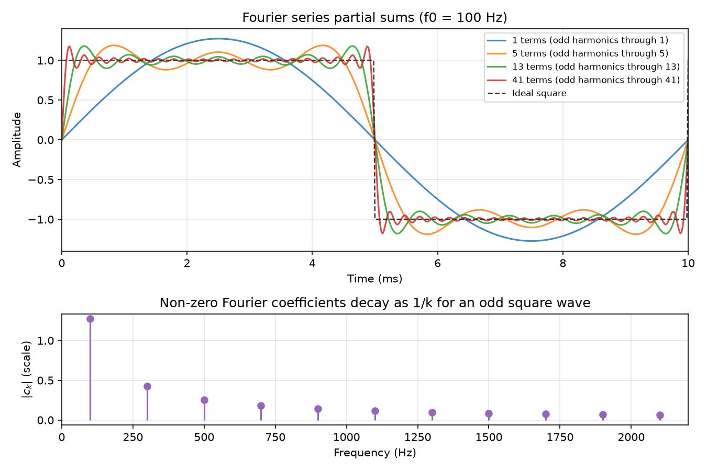

# Fourier Representation {#ch-05-fourier}

## Purpose

Audio signals are rarely single sinusoids. They are **sums** of sinusoids at related frequencies—
harmonics of a pitch, partials of a vowel, or continuous blends of energy across the spectrum. The
**Fourier representation** makes that decomposition explicit: a signal is expressed as weights on
complex exponentials $e^{j\Omega n}$ (or $e^{j2\pi ft}$ in continuous time). This chapter develops
the intuition and mathematics of that decomposition— Fourier series for periodic signals, Fourier
transforms for non-periodic signals, and the bridge to the DFT in [Chapter 6](#ch-06-dft-fft).

## Learning Objectives

By the end of this chapter, the reader should be able to:

1. Explain **orthogonality** of complex exponentials and why sinusoids make a convenient basis
2. Write a **Fourier series** for a periodic signal and interpret its coefficients
3. State the **continuous Fourier transform** pair and its units/intuition
4. Describe the **DTFT** as the frequency representation of an infinite discrete-time sequence
5. Relate Fourier series, DTFT, and **DFT** as different views on the same underlying idea

## Representation lens

| Question | Fourier answer |
|----------|----------------|
| **What is the representation?** | Weights on complex exponentials— series/DTFT/CTFT coefficients |
| **What does it preserve?** | Sinusoidal content and phase relationships in orthogonal decomposition |
| **What does it discard?** | Non-sinusoidal transients unless enough partials; infinite-duration tail in finite sums |
| **Maps in/out via** | Analysis integral/sum; synthesis superposition; DFT samples DTFT ([Chapter 6](#ch-06-dft-fft)) |
| **Numerical mistakes** | Gibbs ringing from truncating series; confusing frequency units |
| **Audible artifacts** | Ringing near discontinuities; dull timbre when truncating harmonics |

## Main Concepts

### Why decompose into sinusoids?

Linear time-invariant systems ([Chapter 9](#ch-09-convolution)) respond to sinusoids with scaled
sinusoids of the same frequency— only magnitude and phase change. Decomposing an input into
sinusoids turns convolution into **multiplication** in frequency. Even when systems are nonlinear,
analysis often starts by tracking how energy **splits across frequency**.

Sinusoids are also **orthogonal** on suitable intervals: distinct frequency components do not "leak"
into each other's inner product when integration (or summation) spans whole periods. That
orthogonality is what makes coefficients unique and recoverable.

### Fourier series (periodic continuous time)

A periodic signal $x(t)$ with period $T_0$ and fundamental frequency $f_0 = 1/T_0$ can be expanded
as

$$
x(t) = \sum_{k=-\infty}^{\infty} c_k \, e^{j 2\pi k f_0 t},
$$

where the **Fourier series coefficients** are

$$
c_k = \frac{1}{T_0} \int_{T_0} x(t)\, e^{-j 2\pi k f_0 t}\, dt.
$$

For **real** $x(t)$, coefficients satisfy $c_{-k} = c_k^*$ (conjugate symmetry from [Chapter
4](#ch-04-sinusoids-complex)).

**Harmonics** are integer multiples $k f_0$. The $k=0$ term is DC; $k=\pm1$ is the fundamental;
$|k|\ge2$ are overtones.

**Example — odd square wave** (amplitude $\pm1$, duty 50%):

Only odd harmonics appear:

$$
x(t) = \frac{4}{\pi}\sum_{\substack{k=1\\ k\ \mathrm{odd}}}^{\infty} \frac{1}{k}\sin(2\pi k f_0 t).
$$

Coefficients decay as $1/k$, so a **partial sum** with few harmonics looks rounded; Gibbs overshoot
near jumps persists even with many terms— a faithful warning that sharp transients need many high-
frequency components (and bandwidth).



### Continuous Fourier transform

For non-periodic energy-limited signals, the **Fourier transform** replaces discrete harmonics with
a continuous frequency variable:

$$
X(f) = \int_{-\infty}^{\infty} x(t)\, e^{-j 2\pi f t}\, dt,
\qquad
x(t) = \int_{-\infty}^{\infty} X(f)\, e^{j 2\pi f t}\, df.
$$

$X(f)$ is generally complex. $|X(f)|$ shows **magnitude vs. frequency**; $\angle X(f)$ shows phase.

**Units:** If $x(t)$ is pressure-like, $X(f)$ carries the corresponding transform units (often
discussed qualitatively; exact scaling depends on convention). In DSP we track **ratios** and
**relative spectra** as often as absolute calibrated units.

**Audio use:** Formants in vowels appear as broad peaks in $|X(f)|$; consonant bursts spread energy
across frequency; EQ curves shape $X(f)$ before inverse transformation (conceptually— real EQ
happens in time or frequency domain implementations).

### DTFT: discrete time, continuous frequency

For a sequence $x[n]$, the **discrete-time Fourier transform (DTFT)** is

$$
X(\Omega) = \sum_{n=-\infty}^{\infty} x[n]\, e^{-j\Omega n},
\qquad
x[n] = \frac{1}{2\pi}\int_{-\pi}^{\pi} X(\Omega)\, e^{j\Omega n}\, d\Omega.
$$

$X(\Omega)$ is **$2\pi$-periodic** in $\Omega$: indistinguishable frequencies alias in the discrete-
time domain ([Chapter 3](#ch-03-sampling-quantization)), reflected as periodicity in $\Omega$.

Relationship to cyclic frequency: $\Omega = 2\pi f / f_s$.

The DTFT is ideal for theoretical analysis of filters $H(\Omega)$ on the unit circle $z =
e^{j\Omega}$.

### Laplace transform (continuous-time systems)

The **Laplace transform** generalizes the Fourier transform to complex frequency $s = \sigma + j\omega$:

$$
X(s) = \int_{0}^{\infty} x(t)\, e^{-st}\, dt.
$$

Poles and zeros of $X(s)$ describe **transient decay** ($\sigma$) and **oscillation** ($\omega$)—
useful for analyzing analog filters, loudspeaker–amplifier loops, and stability before
discretization. For audio DSP the **$j\omega$ axis** (Fourier transform) is most common, but
Laplace notation connects hardware datasheets to discrete models.

The **bilinear transform** maps $s$-plane designs to $z$-plane IIR filters ([Chapter
10](#ch-10-filters)). Understanding $H(s)$ first often clarifies why a biquad shelf behaves as it
does in the analog prototype.

| Domain | Variable | Typical use |
|--------|----------|-------------|
| Continuous Fourier | $f$ or $\omega$ | Spectra, analog EQ |
| Laplace | $s=\sigma+j\omega$ | Stability, analog prototypes |
| DTFT / $z$ | $\Omega$, $z=e^{j\Omega}$ | Discrete filter design |

### From infinite sums to the DFT

Three practical constraints force the **DFT** ([Chapter 6](#ch-06-dft-fft)):

1. We observe **finite** length-$N$ segments.
2. Computers store **finite** arrays.
3. We evaluate frequency on a **discrete grid** of $N$ bins.

The DFT computes $N$ coefficients $X[k]$ that match samples of the DTFT of an $N$-periodic extension
of a finite segment— coupling **periodicity in time** (implicit wrap) with **discrete frequency
bins** spaced by $\Delta f = f_s/N$.

| Representation | Time domain | Frequency domain |
|----------------|-------------|------------------|
| Fourier series | Continuous, periodic | Discrete harmonics $k f_0$ |
| Fourier transform | Continuous, aperiodic | Continuous $f$ |
| DTFT | Discrete $n\in\mathbb{Z}$ | Continuous $\Omega$ (periodic) |
| DFT | Discrete, length $N$ | Discrete bins $k=0,\ldots,N-1$ |

Keep this table nearby when choosing tools: the **same sinusoid basis**, different sampling of time
and frequency.

### Magnitude, phase, power, and energy

For coefficient or transform value $X$:

- **Magnitude** $|X|$ — component strength (after consistent scaling)
- **Phase** $\angle X$ — shift of that component
- **Power** $|X|^2$ in Parseval contexts — energy contribution

Do not plot $|X|^2$ and call it "amplitude." [Chapter 6](#ch-06-dft-fft) standardizes DFT scaling
conventions; until then, track whether your software applies $1/N$ normalization on inverse
transforms.

### Orthogonality (sketch)

On one period of a periodic signal, complex exponentials at different harmonics satisfy

$$
\frac{1}{T_0}\int_{T_0} e^{j 2\pi k f_0 t} e^{-j 2\pi m f_0 t}\, dt = \delta_{km}.
$$

Discrete-time version on length-$N$ sequences underlies the DFT's invertibility. Orthogonality is
why **projection** (correlate with $e^{-j\Omega n}$) extracts one component without mixing others—
when the observation window aligns with the basis.

## Mathematical Formulation

**Real trigonometric series** (alternative form):

$$
x(t) = a_0 + \sum_{k=1}^{\infty}\bigl[a_k \cos(2\pi k f_0 t) + b_k \sin(2\pi k f_0 t)\bigr].
$$

**Parseval (periodic):** average power equals sum of squared magnitudes of series coefficients (with
consistent normalization).

**DTFT pair** (using $\Omega$):

$$
X(\Omega) = \sum_{n=-\infty}^{\infty} x[n] e^{-j\Omega n}.
$$

**Frequency response preview:** For LTI $h[n]$ with DTFT $H(\Omega)$, output spectrum is $Y(\Omega)
= H(\Omega) X(\Omega)$ when transforms exist— multiplication in frequency, convolution in time
([Chapter 9](#ch-09-convolution)).

## Audio Interpretation

**Vocal vowel /a/** — energy concentrated at harmonics of fundamental $f_0$ (pitch), with peaks at
formant-related groups of harmonics. Fourier series thinking applies locally when pitch is stable;
when pitch glides, time–frequency methods ([Chapter 8](#ch-08-stft)) replace a single global series.

**Square-like synthesizer wave** — bright, buzzy timbre because odd harmonics decay slowly ($1/k$).
Low-pass filtering removes high harmonics, darkening the tone— a direct manipulation of Fourier
coefficients.

**Snare drum** — short, non-periodic burst; Fourier **transform** picture (continuous $f$) suits
isolated hits better than a single periodic series over all time.

## Implementation Notes

### Partial sums in code

`examples/fourier_series_square_wave.py` builds an odd square wave from sines:

```python
x = np.zeros_like(t)
for k in range(num_odd_harmonics):
    n = 2 * k + 1
    x += (4 / (n * np.pi)) * np.sin(2 * np.pi * n * f0 * t)
```

Increase `num_odd_harmonics` and listen (optional export to WAV) to hear **convergence** and
remaining buzz.

```bash
python examples/fourier_series_square_wave.py
```

### Toward the FFT

NumPy's `np.fft.fft` implements the DFT for finite arrays— not the infinite DTFT. Before calling
`fft` in [Chapter 6](#ch-06-dft-fft), ask: **What finite segment am I analyzing?** **What implicit
periodic extension does that imply?**

### Numerical integration of coefficients

For arbitrary periodic waveforms, estimate $c_k$ by correlating one period with $e^{-j2\pi k f_0 t}$
using dense sampling— useful for custom wavetable analysis ([Chapter 18](#ch-18-synthesis)).

## Worked Example

**Problem:** A periodic square-like synthesizer tone at fundamental $f_0 = 220\,\mathrm{Hz}$ uses
only the first three odd harmonics ($220, 660, 1100\,\mathrm{Hz}$) with amplitudes proportional to
$1/k$. What are their sine amplitudes (peak), and what is the approximate RMS of the result?

**Sine amplitudes** (odd square scaling $4/(k\pi)$ for unit square):

| Harmonic | $f$ (Hz) | Peak amplitude |
|----------|----------|----------------|
| $k=1$ | 220 | $4/\pi \approx 1.273$ |
| $k=3$ | 660 | $4/(3\pi) \approx 0.424$ |
| $k=5$ | 1100 | $4/(5\pi) \approx 0.255$ |

Each sine is $\sin(2\pi k f_0 t)$ with zero phase.

**RMS:** For uncorrelated orthogonal components on a period, mean square adds:

$$
\mathrm{RMS}^2 \approx \frac{1}{2}\left[\left(\frac{4}{\pi}\right)^2 + \left(\frac{4}{3\pi}\right)^2
+ \left(\frac{4}{5\pi}\right)^2\right].
$$

Numerically $\mathrm{RMS} \approx 0.97$ (peak of sum can exceed any single partial because phases
align constructively at some instants— peak $\ne$ RSS of peaks).

## Common Pitfalls

1. **Confusing Fourier series with Fourier transform.** Series: discrete harmonics for periodic
signals. Transform: continuous spectrum for non-periodic signals.

2. **Ignoring implicit periodicity of the DFT.** A length-$N$ DFT assumes an $N$-sample periodic
signal— affects interpretation of finite clips ([Chapter 7](#ch-07-windowing)).

3. **Gibbs overshoot near discontinuities.** Truncating a series does not remove overshoot near
jumps; more terms sharpen but do not eliminate the Gibbs phenomenon near ideal discontinuities.

4. **Using magnitude-only models.** Dropping phase destroys time-domain structure; resynthesis from
$|X(f)|$ alone fails without phase recovery heuristics.

5. **Unit circle vs. Hz confusion.** DTFT uses $\Omega$; always convert with $\Omega = 2\pi f/f_s$
when comparing to Hz readouts.

6. **Treating FFT output as continuous $X(f)$.** Bins are samples of a periodic DTFT; interpolate or
zero-pad thoughtfully if finer grid is needed.

## Exercises

1. For period $T_0 = 5\,\mathrm{ms}$, what are $f_0$ and the first three harmonic frequencies in Hz?
2. Why does an **even** square wave (symmetric about time) contain only cosine (or even) terms— no
sine components?
3. Compute $c_1$ for $x(t)=\cos(2\pi f_0 t)$ over one period using the integral formula (should be
non-zero only at $\pm1$).
4. Run `fourier_series_square_wave.py`. How does RMS error change if you double the number of odd
harmonics?
5. A vowel has fundamental $150\,\mathrm{Hz}$ and strong energy near $700\,\mathrm{Hz}$ and
$1200\,\mathrm{Hz}$. In a harmonic series picture, which harmonic indices $k$ are nearest those
formant regions?

*Selected solutions: [Appendix — Exercise Solutions](#ch-23-exercise-solutions).*

## Further Reading

- Oppenheim & Schafer, *Discrete-Time Signal Processing* — DTFT, DFT, convergence [@oppenheim2010discrete]
- Julius O. Smith, *Spectral Audio Signal Processing* — Fourier theorems for audio [@smith2011spectral]
- Lyons, *Understanding Digital Signal Processing* — intuitive transform definitions [@lyons2011understanding]
- Roads, *The Computer Music Tutorial* — additive/harmonic thinking in synthesis [@roads1996computer]

**Next chapter:** [DFT, FFT, and Spectral Analysis](#ch-06-dft-fft) computes discrete spectra on
finite buffers and connects bin index $k$ to hertz.
