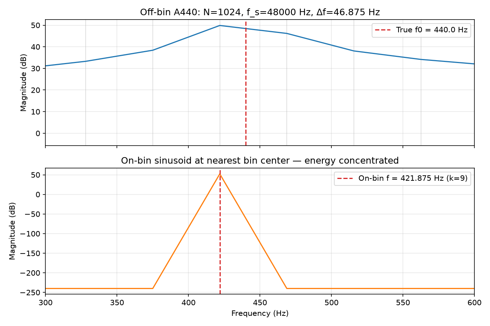

# DFT, FFT, and Spectral Analysis

## Purpose

Chapter 5 explained why signals decompose into complex sinusoids. The **discrete Fourier transform (DFT)** is the workhorse that computes those weights for a **finite** buffer $x[0],\ldots,x[N-1]$ on a **discrete grid** of $N$ frequency bins. The **FFT** is a fast algorithm for the same result. This chapter defines the DFT precisely, interprets magnitude and phase spectra, and connects bin index $k$ to hertz— resolving the off-by-frequency bugs previewed in Chapters 1 and 2.

## Learning Objectives

By the end of this chapter, the reader should be able to:

1. Write the **DFT and inverse DFT** and explain what each bin $X[k]$ represents
2. Compute **bin spacing** $\Delta f = f_s/N$ and map bin center frequencies to Hz
3. Plot and interpret **magnitude** $|X[k]|$ and **phase** $\angle X[k]$ for real audio
4. Explain **conjugate symmetry** for real $x[n]$ and why `rfft` returns $N/2+1$ bins
5. Distinguish the **DFT** (definition) from the **FFT** (algorithm) and avoid common scaling mistakes

## Main Concepts

### What problem the DFT solves

Given $N$ samples of a real or complex sequence, the DFT answers: **how much** of each discrete frequency component $e^{j 2\pi k n / N}$ is present in that segment? The output is $N$ complex coefficients $X[k]$— one per bin.

The DFT assumes an **implicit $N$-sample periodic extension** of the buffer. A finite clip of a piano note is treated as one period of a repeating signal— a modeling choice with consequences (discontinuity at wrap → broadband energy; Chapter 7).

### Definition

For $n, k \in \{0, 1, \ldots, N-1\}$:

$$
X[k] = \sum_{n=0}^{N-1} x[n]\, e^{-j 2\pi k n / N}.
$$

**Inverse DFT:**

$$
x[n] = \frac{1}{N}\sum_{k=0}^{N-1} X[k]\, e^{j 2\pi k n / N}.
$$

NumPy's `np.fft.fft` uses this convention; the $1/N$ is on the inverse (`ifft`). Always verify library scaling when comparing to textbook tables or other tools.

The DFT represents the finite sequence as a weighted sum of complex sinusoids whose normalized frequencies are **exactly** on the grid $\Omega_k = 2\pi k / N$:

$$
x[n] = \frac{1}{N}\sum_{k=0}^{N-1} X[k]\, e^{j 2\pi k n / N}.
$$

### Bin index and hertz

Bin spacing in hertz:

$$
\Delta f = \frac{f_s}{N}.
$$

The **center frequency** of bin $k$ (for $0 \le k \le N/2$) is

$$
f_k = k\,\Delta f = k\,\frac{f_s}{N}.
$$

**Example:** $f_s = 48000\,\mathrm{Hz}$, $N = 1024$ → $\Delta f = 46.875\,\mathrm{Hz}$. Bin $k=9$ centers at $421.875\,\mathrm{Hz}$; bin $k=10$ at $468.75\,\mathrm{Hz}$. **A440 is not on the grid** for that $(f_s, N)$ pair.

Picking the peak bin is **not** exact frequency estimation when the tone falls between bins— energy **leaks** into neighbors (rectangular window effect; Chapter 7).



### Magnitude and phase

Each $X[k] = |X[k]| e^{j \angle X[k]}$ encodes how a complex sinusoid at bin $k$ would need to be scaled and shifted to contribute to $x[n]$.

- **Magnitude** $|X[k]|$ — strength of that bin's component (before normalization conventions)
- **Phase** $\angle X[k]$ — radians; relative timing of the component

For **real** $x[n]$, the DFT is **conjugate symmetric**:

$$
X[k] = X^*[N-k], \qquad k = 1,\ldots,N-1,
$$

with $X[0]$ real (DC) and, for even $N$, $X[N/2]$ real (Nyquist bin). Positive-frequency plots use $k = 0,\ldots,N/2$ only— half the redundant data.

**Do not** confuse $|X[k]|$ with time-domain peak amplitude $|x[n]|$. Parseval relates total energy:

$$
\sum_{n=0}^{N-1} |x[n]|^2 = \frac{1}{N}\sum_{k=0}^{N-1} |X[k]|^2
$$

(with the NumPy convention above).

### The FFT

The **fast Fourier transform (FFT)** computes the DFT in $O(N \log N)$ instead of $O(N^2)$ [@cooley1965fft]. **Mathematically identical** to the DFT up to floating-point rounding— not a different transform.

In Python:

```python
X = np.fft.fft(x)           # length N
X_pos = np.fft.rfft(x)      # length N//2 + 1, real input
x_back = np.fft.ifft(X)     # inverse, applies 1/N scaling
```

Use `rfft` for real audio to avoid redundant negative-frequency bins.

### Spectral analysis workflow

A minimal analysis pipeline:

1. Choose segment length $N$ (tradeoff: $\Delta f$ vs. time resolution)
2. Optionally apply window $w[n]$ (Chapter 7)
3. Compute `X = np.fft.rfft(x * w)`
4. Convert to dB if desired: `20*np.log10(np.abs(X) + eps)`
5. Map indices to Hz: `freqs = np.fft.rfftfreq(N, d=1/fs)`

Report **which window**, **which $N$**, and **which $f_s$** whenever you show a spectrum.

### Zero padding

Appending zeros before the DFT **interpolates** a finer frequency grid; it does **not** add true resolution. True resolution comes from longer **non-zero** observation (larger $N$ of actual data) or appropriate windowing— not from zero padding alone.

## Mathematical Formulation

**DFT as correlation:** $X[k]$ is the inner product of $x[n]$ with the $k$-th analysis sinusoid:

$$
X[k] = \langle x[n], e^{j 2\pi k n / N}\rangle = \sum_{n=0}^{N-1} x[n]\, e^{-j 2\pi k n / N}.
$$

**Periodicity in $k$:** $X[k+N] = X[k]$ when defined for all integers $k$— the DTFT sampled at $N$ points.

**Real sinusoid at bin $k_0$:** If $x[n] = A\cos(2\pi k_0 n/N + \phi)$ with integer $k_0$, energy concentrates at bins $k_0$ and $N-k_0$ (and symmetric partners)— not a single bin unless phasor form is used.

## Audio Interpretation

**Tuning meter fantasy:** Peak-picking one FFT bin without interpolation mis-estimates pitch when $f_0$ is not a multiple of $\Delta f$— common for A440 at short $N$.

**EQ visualization:** Many plugins show magnitude spectra smoothed across bins; smoothing hides leakage but also blurs narrow peaks.

**Noise floor:** FFT of silence is not zero— quantization noise and window sidelobes appear; use dB scale and know your noise floor (Chapter 21).

## Implementation Notes

### Executable example

`examples/dft_bin_spacing.py` compares A440 (off-bin) vs. a sinusoid at the nearest bin center:

```bash
python examples/dft_bin_spacing.py
```

### Phase plots

```python
phase = np.angle(X)
phase_unwrapped = np.unwrap(phase)
```

Useful for group delay and vocoder work (later chapters); many analysis UIs hide phase.

### Common NumPy patterns

```python
import numpy as np

fs = 48_000
N = 2048
x = ...  # length N
X = np.fft.rfft(x)
freqs = np.fft.rfftfreq(N, d=1/fs)
mag_db = 20 * np.log10(np.abs(X) + 1e-12)
```

## Worked Example

**Problem:** $f_s = 48000\,\mathrm{Hz}$, $N = 2048$, real buffer $x[n] = \cos(2\pi \cdot 1000 \cdot n / f_s)$.

**(a) Bin spacing:**

$$
\Delta f = \frac{48000}{2048} \approx 23.4375\,\mathrm{Hz}.
$$

**(b) Nearest bin to $1000\,\mathrm{Hz}$:**

$$
k = \mathrm{round}\left(\frac{1000}{\Delta f}\right) = \mathrm{round}(42.67) = 43,
\quad f_{43} = 43 \cdot \Delta f = 1007.8125\,\mathrm{Hz}.
$$

The tone is **not** exactly on-bin; expect leakage unless $N$ is chosen so $1000/\Delta f$ is integer.

**(c) On-bin choice:** Pick $k_0 = 42$ → $f = 984.375\,\mathrm{Hz}$ or adjust $N$ so $f_s/N$ divides 1000. For exact 1000 Hz on grid, need $1000 = k f_s/N$ → $k/N = 1/48$. Example: $k=1$, $N=48$ ( impractically short segment ) or $k=25$, $N=1200$ at same $f_s$.

## Common Pitfalls

1. **Confusing bin index with Hz.** Always multiply $k$ by $\Delta f$.

2. **Forgetting $1/N$ on inverse.** Composing `fft`/`ifft` in NumPy recovers $x$; manual synthesis without $1/N$ scales wrong.

3. **Treating FFT as continuous spectrum.** Bins are samples; peaks between bins are ambiguous without interpolation.

4. **Using magnitude-only and expecting perfect resynthesis.** Need $X[k]$ including phase (up to conjugate symmetry for real signals).

5. **Wrong segment length.** `fft` on length $\ne N$ pads or truncates— know your effective $N$.

6. **Comparing dB spectra across different windows/scales.** State normalization (0 dB = full scale? peak bin?).

7. **Ignoring implicit periodicity.** End sample $\ne$ start sample → wide spectral skirt even for pure tones.

## Exercises

1. $f_s=44100\,\mathrm{Hz}$, $N=4096$. Compute $\Delta f$ and the Hz of bin $k=100$.
2. Show that for real $x[n]$, $X[0]$ is real and equals the sum $\sum_n x[n]$.
3. Generate a 440 Hz sine at 48 kHz for $N=1024$. Which bin has maximum $|X[k]|$? Is it exactly 440 Hz?
4. Zero-pad the same buffer to $4N$ before FFT. How does the frequency grid change? Does true resolution improve?
5. Implement manual DFT for one bin $k$ with a loop; compare to `np.fft.fft` for a short test vector.

## Further Reading

- Cooley & Tukey, FFT algorithm [@cooley1965fft]
- Oppenheim & Schafer, DFT/FFT properties and computation [@oppenheim2010discrete]
- Julius O. Smith, *Spectral Audio Signal Processing* [@smith2011spectral]
- Welch, modified periodograms (power spectrum estimation preview) [@welch1967fft]

**Next chapter:** Chapter 07 — *Windowing, Leakage, and Resolution* controls sidelobes and the time–frequency width of spectral estimates.
