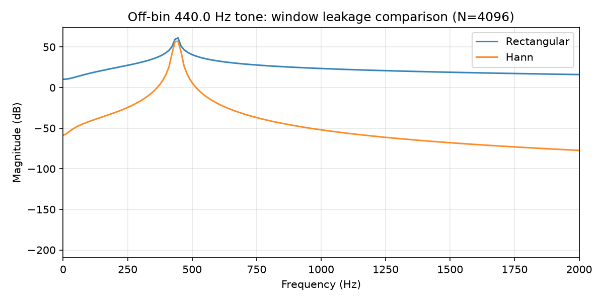

# Windowing, Leakage, and Resolution {#ch-07-windowing}

## Purpose

Chapter 6 (@sec:ch-06-dft-fft) showed that a finite DFT segment behaves as if the signal repeats every $N$ samples and that off-bin tones spread energy across bins. **Windowing** tapers the segment edges to reduce the artificial discontinuity at the wrap point and to control **spectral leakage**. This chapter explains window tradeoffs: main-lobe width (frequency resolution) versus sidelobe level (leakage suppression)— the core time–frequency uncertainty behind spectral analysis.

## Learning Objectives

By the end of this chapter, the reader should be able to:

1. Define **spectral leakage** and relate it to finite observation and implicit periodicity
2. Apply common windows (rectangular, Hann, Hamming, Blackman) and predict their effects
3. Compare **main-lobe width** and **sidelobe** behavior qualitatively
4. Choose window length and type for a given analysis goal (tonal vs. transient)
5. Avoid confusing windowing with true spectral resolution from longer data

## Main Concepts

### Why window?

Multiplying $x[n]$ by a window $w[n]$ before the DFT:

$$
X_w[k] = \sum_{n=0}^{N-1} x[n]\, w[n]\, e^{-j 2\pi k n / N}
$$

tapers samples toward zero at the edges. This reduces the **spectral smearing** caused by abruptly truncating a signal as if it were periodic. Without tapering, even a pure tone leaks when its frequency falls between DFT bins (@sec:ch-06-dft-fft).

The cost: tapering **reduces effective data amplitude** near edges and **broadens** the main lobe of a tonal peak— you trade leakage for resolution.

### Rectangular window

$w[n] = 1$ for $0 \le n < N$. Narrowest main lobe ($\Delta f \approx f_s/N$) but **highest sidelobes** (~−13 dB). Strong leakage from strong off-bin tones can mask weak nearby components.

### Hann window

$$
w[n] = 0.5\left(1 - \cos\frac{2\pi n}{N-1}\right).
$$

Sidelobes fall faster (~−32 dB first sidelobe region) at the cost of a **wider main lobe** (~2× rectangular). Very common in audio STFT (@sec:ch-08-stft).

### Hamming, Blackman, Kaiser

- **Hamming:** slightly lower first sidelobe than Hann, non-zero edge samples
- **Blackman:** very low sidelobes, wide main lobe— good for detecting weak tones near strong ones
- **Kaiser:** parametric tradeoff via $\beta$ [@oppenheim2010discrete]



### Resolution vs leakage

**Frequency resolution** (ability to separate two close tones) improves with **longer** windows (more samples at fixed $f_s$). Window **shape** controls sidelobes, not the fundamental $\Delta f = f_s/N$ bin grid.

Two tones closer than main-lobe width **merge** in the spectrum even with perfect windows.

### Coherent gain and amplitude correction

Windows reduce RMS of tapered data. For magnitude calibration:

$$
\text{CG} = \frac{1}{N}\sum_{n=0}^{N-1} w[n].
$$

Compensate peak estimates by dividing by coherent gain (or use energy-conserving norms for power spectra).

## Mathematical Formulation

Windowed DFT:

$$
X_w[k] = \sum_{n=0}^{N-1} x[n]\, w[n]\, e^{-j 2\pi k n / N}.
$$

Convolutional view: windowing in time **convolves** the true spectrum with the window's spectrum $W[k]$— smearing each bin.

Parseval with window: energy in time matches scaled energy in frequency only with consistent normalization.

## Audio Interpretation

**Piano note analysis:** Hann STFT balances leakage and resolution; rectangular window can create false partials near strong harmonics.

**Snare transient:** long windows blur attack time; short windows widen frequency peaks— motivates @sec:ch-08-stft.

## Implementation Notes

```python
import numpy as np
w = np.hanning(N)
X = np.fft.rfft(x[:N] * w)
```

Run `python examples/window_leakage_demo.py`.

SciPy: `scipy.signal.get_window('hann', N)`.

## Worked Example

**Problem:** $f_s=48000$, $N=4096$, off-bin 440 Hz tone. Compare peak sidelobe region qualitatively: rectangular first sidelobe ~−13 dB relative to peak; Hann ~−32 dB. If a −40 dB partial sits 200 Hz away, which window reveals it?

**Answer:** Hann/Blackman likely reveal the weak partial; rectangular sidelobes from the strong 440 Hz component may swamp it.

## Common Pitfalls

1. **Expecting window to beat $\Delta f$ limit.** Only longer **data** (or lower $f_s$) narrows bin spacing.
2. **Forgetting amplitude correction** when reporting dBFS spectra.
3. **Using different windows** without relabeling comparisons.
4. **Zero-padding mistaken for resolution** (@sec:ch-06-dft-fft).

## Exercises

1. Compute coherent gain for length-1024 Hann window (simulate in NumPy).
2. Why does symmetric Hann use $N-1$ in the cosine denominator?
3. Plot spectra of a 1000 Hz tone with rectangular and Blackman windows; measure main-lobe width at −3 dB.
4. When analyzing drum transients, argue for shorter $N$ even if $\Delta f$ worsens.

## Further Reading

- Oppenheim & Schafer [@oppenheim2010discrete]
- Smith, *Spectral Audio Signal Processing* [@smith2011spectral]
- Harris, classic window survey [@harris1978windows]

**Next chapter:** @sec:ch-08-stft — *STFT, Spectrograms, and Time–Frequency Analysis*.
