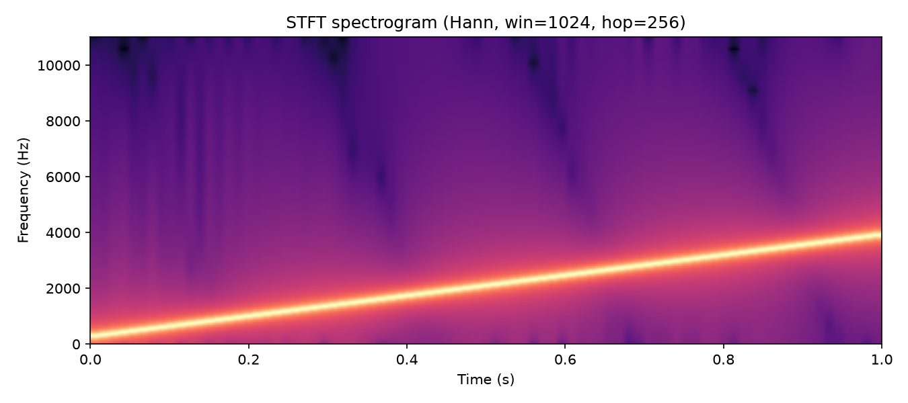

# STFT, Spectrograms, and Time–Frequency Analysis {#ch-08-stft}

## Purpose

A single DFT (@sec:ch-06-dft-fft) describes **one** time segment. Audio evolves: notes start, formants shift, consonants burst. The **short-time Fourier transform (STFT)** applies windowed DFTs (@sec:ch-07-windowing) to overlapping frames, producing a **time–frequency matrix**— the basis of spectrograms, many audio features, and perceptual front-ends.

## Learning Objectives

By the end of this chapter, the reader should be able to:

1. Define the STFT with window length $M$, hop size $R$, and frame index $m$
2. Build and plot a **spectrogram** (magnitude vs. time and frequency)
3. Explain the **time–frequency tradeoff** (window length vs. temporal resolution)
4. Choose STFT parameters for speech, music, and transient-rich signals
5. Relate STFT to overlapping analysis in libraries (librosa, scipy)

## Main Concepts

### STFT definition

Frame $m$ starting at sample $mR$:

$$
X_m[k] = \sum_{n=0}^{M-1} x[mR + n]\, w[n]\, e^{-j 2\pi k n / M}.
$$

- $M$ — window length (frequency resolution $\approx f_s/M$)
- $R$ — hop size (time step between frames: $R/f_s$ seconds)
- $w[n]$ — window (@sec:ch-07-windowing)

**Spectrogram:** $|X_m[k]|$ or $|X_m[k]|^2$ displayed with time on one axis, frequency on the other [@allen1977unified].



### Time–frequency tiling

Long $M$ → narrow frequency bins, **blurred** temporal events. Short $M$ → good time localization, **wide** frequency bands. Uncertainty is structural, not an implementation bug.

Rule of thumb:

| Goal | Window | Typical $M$ at 44.1 kHz |
|------|--------|-------------------------|
| Pitch/harmonics | Hann | 2048–4096 |
| Onsets/transients | Hann | 512–1024 |
| Speech formants | Hann | 512–1024 |

### Overlap

Overlap fraction: $(M-R)/M$. 50–75% overlap (Hann) reduces scalloping between frames in reconstruction-oriented STFT. Analysis-only spectrograms often use $R = M/4$ or $M/2$.

### COLA and invertibility

**Constant overlap-add (COLA)** conditions allow perfect STFT inversion with synthesis window [@allen1977unified]. Phase vocoders and some effects require careful STFT pair design— magnitude-only inversion fails (Griffin–Lim).

### Reassignment and alternatives (preview)

**Reassigned spectrograms** sharpen ridges; **constant-Q transform** (Chapter 15/17) uses log-frequency spacing for music. **Wavelets** offer another tiling— outside core path but same tradeoff theme.

## Mathematical Formulation

Grid:

$$
t_m = \frac{mR}{f_s}, \qquad f_k = k\frac{f_s}{M}, \qquad 0 \le k \le M/2.
$$

Energy density (Parseval-style, approximate):

$$
\sum_n |x[n]|^2 \approx \frac{1}{M}\sum_m\sum_k |X_m[k]|^2 / \text{(overlap factor)}.
$$

## Audio Interpretation

**Vowel /a/:** horizontal harmonic stripes in spectrogram; formants as energy bands.

**Chirp / siren:** rising ridge— STFT captures motion single DFT cannot.

**Mixture:** overlapping ridges; source separation exploits STFT structure (advanced topic).

## Implementation Notes

```python
import numpy as np
M, R = 1024, 256
w = np.hanning(M)
frames = [np.fft.rfft(x[i:i+M]*w) for i in range(0, len(x)-M, R)]
S = np.abs(frames).T
```

Run `python examples/stft_spectrogram_demo.py`.

`librosa.stft` / `scipy.signal.stft` handle padding and frequency grids— read docs for `center`, `n_fft`, `hop_length`.

## Worked Example

**Problem:** $f_s=22050$, $M=1024$, $R=256$. Frame rate? Bin spacing? Time span of one frame?

**Answers:**

- $\Delta f = 22050/1024 \approx 21.53$ Hz
- Frame every $256/22050 \approx 11.6$ ms → ~86 frames/s
- Frame duration $1024/22050 \approx 46.4$ ms

## Common Pitfalls

1. **Confusing spectrogram color scale** (dB ref varies).
2. **Too-small $M$** for bass pitch tracking.
3. **Ignoring padding** in library STFT (affects phase, bin alignment).
4. **Treating $|X_m[k]|$ as narrowband filter output** without window bandwidth.

## Exercises

1. For $M=2048$, $R=512$ at 48 kHz, compute overlap percent and frames per second.
2. Generate a two-tone signal turning on at different times; sketch expected spectrogram.
3. Compare same signal with $M=256$ vs $M=4096$; describe tradeoff you hear/see.
4. Why does vocal formant tracking prefer moderate $M$?

## Further Reading

- Allen & Rabiner [@allen1977unified]
- Müller, *Fundamentals of Music Processing* [@muller2015fundamentals]
- Smith, *Spectral Audio Signal Processing* [@smith2011spectral]

**Next chapter:** @sec:ch-09-convolution — *Convolution and Impulse Responses*.
