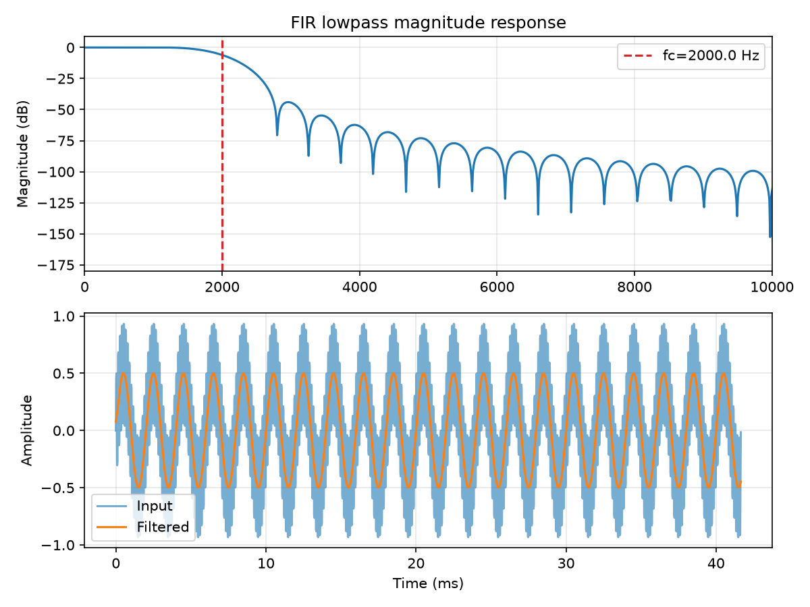
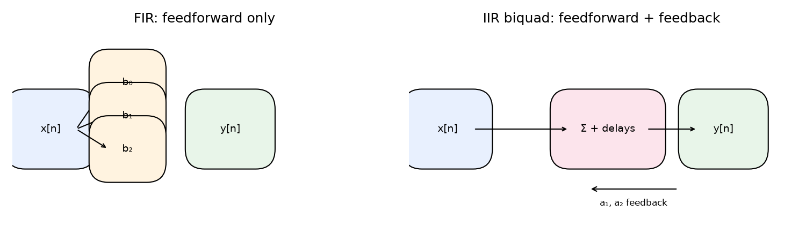

# Filters: FIR, IIR, and the Z-Transform {#ch-10-filters}

## Purpose

**Filters** shape frequency content: remove rumble, isolate bands, smooth envelopes. This chapter
introduces **FIR** and **IIR** structures, the **z-transform** transfer function $H(z)$, and
frequency response $H(\Omega)$— the design vocabulary for EQ, crossovers, and analysis filters.

## Representation lens

| Question | Filter answer |
|----------|---------------|
| **What is the representation?** | Coefficients $b_k,a_k$ or $H(z)$ describing frequency shaping |
| **What does it preserve?** | Designed passband/stopband shape (LTI) |
| **What does it discard?** | Out-of-band energy (when stable/causal design succeeds) |
| **Maps in/out via** | Difference equation, convolution with $h[n]$, or $z$-domain algebra |
| **Numerical mistakes** | Unstable poles; coefficient quantization; wrong normalized frequency |
| **Audible artifacts** | Ringing, instability whistles, zipper noise from bad coefficient updates |

## Learning Objectives

By the end of this chapter, the reader should be able to:

1. Write difference equations for FIR and IIR filters
2. Interpret $H(z)$ poles and zeros and relate them to stability
3. Compute and plot **magnitude and phase** of $H(\Omega)$
4. Design a basic windowed-sinc **FIR lowpass**
5. Choose FIR vs IIR for a stated latency/phase/stability constraint

## Main Concepts

### FIR filter

$$
y[n] = \sum_{k=0}^{M} b_k\, x[n-k].
$$

Impulse response $h[n]=b_n$ for $0\le n\le M$. **Always BIBO stable.** Can achieve **exact linear
phase** (symmetric $b_k$).

Transfer function:

$$
H(z) = \sum_{k=0}^{M} b_k z^{-k}.
$$

All poles at origin (polynomial in $z^{-1}$ only).

### IIR filter

$$
y[n] = \sum_{k=0}^{M} b_k x[n-k] - \sum_{k=1}^{P} a_k y[n-k], \quad a_0=1.
$$

$$
H(z) = \frac{\sum_{k=0}^{M} b_k z^{-k}}{1 + \sum_{k=1}^{P} a_k z^{-k}}.
$$

**Poles** (roots of denominator) must lie **inside unit circle** for stability
[@oppenheim2010discrete].

Efficient for steep slopes (fewer coefficients than FIR) but nonlinear phase unless specialized.

### Frequency response

Evaluate on unit circle $z=e^{j\Omega}$:

$$
H(\Omega) = H(z)\big|_{z=e^{j\Omega}}.
$$

$|H(\Omega)|$ — gain vs frequency; $\angle H(\Omega)$ — phase shift.



### Windowed-sinc FIR lowpass

Ideal lowpass impulse response:

$$
h_{\text{ideal}}[n] = \frac{2f_c}{f_s}\,\mathrm{sinc}\!\left(\frac{2f_c}{f_s}\left(n -
\frac{M}{2}\right)\right).
$$

Truncate and multiply by window (Hann)— `fir_lowpass_demo.py`.

### Biquads

Second-order sections (biquads) cascade for EQ shelves/peaks— standard in audio engines; each
section is order-2 IIR.

## Mathematical Formulation

Z-transform of $x[n]$:

$$
X(z) = \sum_{n=-\infty}^{\infty} x[n] z^{-n}.
$$

LTI: $Y(z) = H(z) X(z)$ (ROC caveats for IIR).

## Audio Interpretation

**High-pass at 80 Hz:** remove DC and rumble on vocals.

**Low-pass before downsampling:** anti-alias ([Sampling, Quantization, and Digital
Audio](#ch-03-sampling-quantization), [Resampling, Interpolation, and Sample-Rate
Conversion](#ch-14-resampling)).

**Parametric EQ:** biquad bank adjusting $|H(\Omega)|$.

## Implementation Notes



```python
from scipy.signal import firwin, freqz
h = firwin(numtaps, cutoff, fs=fs, window='hann')
w, H = freqz(h, worN=4096, fs=fs)
```

Run `python examples/fir_lowpass_demo.py`.

**Direct Form I/II** difference equations for real-time; watch denormals and coefficient
quantization ([Testing, Measurement, and Numerical Pitfalls](#ch-21-testing-pitfalls)).

## Worked Example

**Problem:** FIR length 101, $f_s=48000$, cutoff 2 kHz. Approximate group delay at low frequencies
for linear-phase symmetric FIR?

**Answer:** $(M/2)/f_s = 50/48000 \approx 1.04$ ms ([Phase, Group Delay, and Minimum
Phase](#ch-12-phase-group-delay) formalizes group delay).

## Common Pitfalls

1. **Unstable IIR** from wrong sign on feedback coefficients.
2. **Coefficient quantization** causing limit cycles.
3. **Ignoring phase** when summing filtered paths (comb filtering).
4. **Designing in Hz without specifying $f_s$.**

## Exercises

1. Write $H(z)$ for $y[n]=0.5x[n]+0.5x[n-1]$. Is it lowpass?
2. Pole at $z=0.9$ — stable? At $z=1.05$?
3. Design FIR cutoff 1 kHz at 44.1 kHz with `firwin`; plot $|H(\Omega)|$.
4. Why do mastering EQs often use minimum-phase IIR?

## Further Reading

- Oppenheim & Schafer [@oppenheim2010discrete]
- Zölzer, *DAFX* [@zoelzer2011dafx]
- Lyons [@lyons2011understanding]

**Next chapter:** [Delay Lines, Comb Filters, and All-Pass Filters](#ch-11-delay-comb-allpass).
