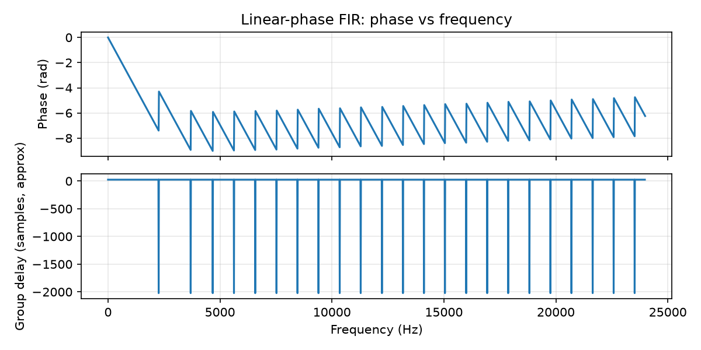

# Phase, Group Delay, and Minimum Phase {#ch-12-phase-group-delay}

## Purpose

Magnitude spectra dominate many displays, but **phase** determines waveform shape and timing of
components. **Group delay** measures how long frequency bundles are delayed through a system.
**Minimum-phase** systems trade pre-ringing for causal, compact envelopes— central to EQ design and
loudspeaker processing.

## Representation lens

| Question | Phase answer |
|----------|--------------|
| **What is the representation?** | Phase $\angle H(\Omega)$ and group delay $\tau_g(\Omega)$ |
| **What does it preserve?** | Timing of frequency bundles through a system |
| **What does it discard?** | Magnitude-only views hide asymmetric timing |
| **Maps in/out via** | Frequency response $H(\Omega)$; Hilbert relation for minimum-phase |
| **Numerical mistakes** | Wrapped phase jumps; ignoring pre-ringing of linear-phase EQ |
| **Audible artifacts** | Pre-ringing; transient smear; phasey stereo image |

## Learning Objectives

By the end of this chapter, the reader should be able to:

1. Interpret **phase response** $\angle H(\Omega)$ and unwrap discontinuities
2. Define **group delay** $\tau_g(\Omega) = -d\angle H(\Omega)/d\Omega$
3. Contrast **linear-phase**, **minimum-phase**, and **mixed-phase** filters
4. Explain pre-ringing from linear-phase steep filters
5. State minimum-phase magnitude–phase relationship (Hilbert preview)

## Main Concepts

### Phase response

For $H(\Omega)=|H(\Omega)|e^{j\phi(\Omega)}$, phase $\phi(\Omega)$ shifts each sinusoidal component.

**Linear phase:** $\phi(\Omega) = -\alpha \Omega + \beta$ → constant group delay $\alpha$ samples
(symmetric FIR).

### Group delay

$$
\tau_g(\Omega) = -\frac{d\phi(\Omega)}{d\Omega}.
$$

Approximate time (seconds) a narrowband component is delayed: $\tau_g/f_s$ samples interpretation
varies with definition— use consistent units.

Large $\tau_g$ variation → **dispersion** (different frequencies arrive at different times)— smears
transients.

### Minimum-phase systems

All poles and zeros **inside unit circle**. For a given magnitude $|H(\Omega)|$, minimum-phase has
**minimum energy delay** (energy concentrated early) [@oppenheim2010discrete].

Magnitude and minimum-phase are related via **Hilbert transform** of log-magnitude (cepstral
domain)— advanced design topic.

### Linear-phase EQ tradeoff

Steep linear-phase lowpass shows **pre-ringing** (Gibbs-like) before sharp cutoff— audible on
percussive material. Minimum-phase IIR often preferred for mastering EQ at cost of phase
nonlinearity.

### All-pass phase

All-pass filters contribute phase only— used to align branches (crossover delay matching).

## Mathematical Formulation

Phase unwrapping:

```python
phi = np.unwrap(np.angle(H))
tau_g = -np.diff(phi, prepend=phi[0])  # discrete approximation
```

## Audio Interpretation

**Crossover networks:** align woofer/tweeter group delay at crossover region.

**Phase vocoder:** STFT ([STFT, Spectrograms, and Time–Frequency Analysis](#ch-08-stft)) phase
propagation critical for quality.

**Polarity flip:** $\phi \to \phi+\pi$ — can cancel in multi-mic setups.

## Implementation Notes



Use `scipy.signal.group_delay` for designed filters. Compare linear-phase FIR vs minimum-phase IIR
on drum loop— listen for pre-ringing vs phase smear.

## Worked Example

**Problem:** Linear-phase FIR length 1025. Group delay at passband?

**Answer:** $(1025-1)/2 = 512$ samples → $512/48000 \approx 10.67$ ms at 48 kHz.

## Common Pitfalls

1. **Ignoring phase in multi-band summing.**
2. **Wrapped phase plots** misread as discontinuities in system.
3. **Assuming minimum-phase is always "better"**— context-dependent.
4. **Confusing phase delay** with group delay for wideband signals.

## Exercises

1. Plot group delay of biquad peaking EQ at Q=5.
2. Why does linear-phase FIR have symmetric impulse response?
3. Listen: compare 500 Hz lowpass, linear vs minimum phase (same magnitude target sketch).
4. Explain polarity inversion on snare top/bottom mics.

*Selected solutions: [Appendix — Exercise Solutions](#ch-23-exercise-solutions).*

## Further Reading

- Oppenheim & Schafer [@oppenheim2010discrete]
- Smith [@smith2010physical]

**Next chapter:** [Envelopes, Loudness, and Dynamics](#ch-13-envelopes-loudness).
