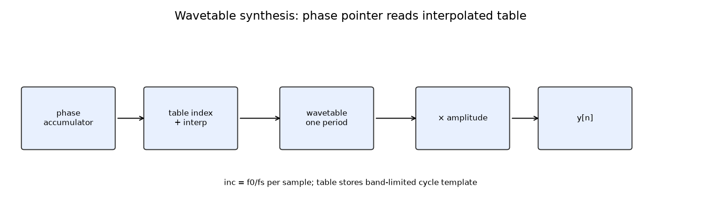
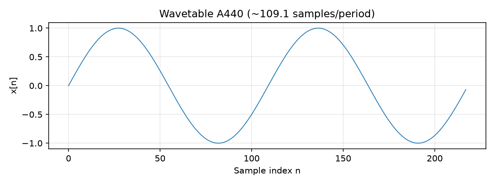

# Synthesis Representations {#ch-18-synthesis}

## Purpose

**Synthesis** generates audio from compact representations: oscillators, wavetables, FM operators,
granular grains. This chapter maps synthesis paradigms to the signal models from earlier chapters
and highlights **band-limited** methods to avoid aliasing ([Sampling, Quantization, and Digital
Audio](#ch-03-sampling-quantization)).

## Representation lens

| Question | Synthesis answer |
|----------|------------------|
| **What is the representation?** | Parameters driving generators: phase pointers, wavetables, FM indices, grain schedules |
| **What does it preserve?** | Pitch, chosen timbre template, control envelopes |
| **What does it discard?** | Full recorded waveform detail unless using large tables or many partials |
| **Maps in/out via** | Oscillator/update → $x[n]$; analysis → parameter extraction (inverse problem) |
| **Numerical mistakes** | Phase resets; aliased discontinuities; FM index without bandwidth control |
| **Audible artifacts** | Clicks at note-on; harsh buzz on high saw/square; granular pulsing |

## Learning Objectives

By the end of this chapter, the reader should be able to:

1. Implement **wavetable** and **phase accumulator** oscillators with phase continuity
2. Explain **subtractive**, **additive**, and **FM** synthesis structures
3. Describe **granular** synthesis parameters (grain size, density, position)
4. Apply **BLEP/BLIT** or oversampling for anti-aliased discontinuities
5. Choose a representation matching target timbre and control needs

## Main Concepts

### Additive synthesis

Sum of sinusoids ([Musical Signal Representations](#ch-17-musical-reps))— powerful, expensive;
control partial amplitudes for timbre morphing [@roads1996computer].

### Subtractive synthesis

Rich source (saw/square/noise) + **filter** ([Filters: FIR, IIR, and the
Z-Transform](#ch-10-filters)) sculpting— classic analog model.

### Wavetable

One period stored; read with interpolating pointer at $f_0$— efficient single-tone; crossfade tables
for morphing.

Phase accumulator:

$$
\phi[n+1] = \phi[n] + 2\pi f_0 / f_s \pmod{2\pi}.
$$

### FM synthesis

$$
x[n] = \sin(\Omega_c n + I \sin(\Omega_m n)).
$$

Sidebands at $f_c \pm k f_m$— compact bright timbres; Bessel theory for indices
[@puckette2007electronic].

### Granular synthesis

Short windowed grains from buffer; parameters: duration, overlap, pitch shift via read rate, scatter
in time— texture and time-stretch.

### Modal / vector synthesis (preview)

Bank of resonators (decaying sinusoids)— relates to physical modeling ([Physical-Modeling
Representations](#ch-19-physical-modeling)).

### Anti-aliased discontinuities

Naive sawtooth aliases ([Sampling, Quantization, and Digital Audio](#ch-03-sampling-quantization)).
**BLEP** (band-limited step) cancels steps; **polyBLEP** common in software synths.

## Mathematical Formulation

FM spectrum (ideal):

$$
x(t) = \sum_{k=-\infty}^{\infty} J_k(I) \sin(\Omega_c t + k \Omega_m t)
$$

($J_k$ Bessel functions)— energy at many sidebands.

## Audio Interpretation

**808 bass:** sine + pitch envelope— wavetable/low partial count.

**Bell:** inharmonic FM or modal partials.

**Pad:** detuned oscillators + filter + chorus (delay modulation, [Delay Lines, Comb Filters, and
All-Pass Filters](#ch-11-delay-comb-allpass)).

## Implementation Notes

Use `audio_toolkit.synthesis` and `audio_toolkit.osc`:

```python
from audio_toolkit.synthesis import wavetable_osc, naive_saw
from audio_toolkit.osc import PhaseOscillator

y = wavetable_osc(48_000, 440.0, num_samples=2400)
osc = PhaseOscillator(48_000, 440.0, amplitude=0.8)
block = osc.render(512)  # phase continues across blocks
```

**Runnable demos:**

```bash
python examples/wavetable_demo.py          # figure + audio_demos/wavetable_a440.wav
python examples/export_audio_demos.py      # aliasing, phase clicks, naive saw, comb
```





Listen to `audio_demos/naive_saw_2200hz.wav` for aliasing on a **naive_saw artifact** (intentional
anti-example)— compare with band-limited methods.

Use oversampling ×2–×8 for nonlinear waveshaping. See `scipy.signal` or synth frameworks (Dexed,
Surge).

## Worked Example

**Problem:** $f_s=48000$, $f_0=1000$ Hz. Phase increment per sample?

**Answer:** $2\pi \cdot 1000/48000 \approx 0.1309$ rad.

**Problem:** Wavetable length 512 at A440. Period in samples?

**Answer:** $f_s/f_0 = 48000/440 \approx 109.09$ samples/period — table holds one **cycle
template**; pointer rate sets pitch.

## Common Pitfalls

1. **Phase reset clicks** at note-on without continuity.
2. **Aliased saw** on high notes— use BLEP or band-limit tables.
3. **FM index too high** without bandwidth control → aliasing.
4. **Granular overlap too low** → audible pulsing.

## Exercises

1. Build wavetable A440; verify period samples $\approx 48$.
2. Two-operator FM: predict first few sideband locations for $f_c=440$, $f_m=220$, small $I$.
3. Granular: 50 ms grains, 50% overlap— grains per second?
4. Compare naive vs polyBLEP saw spectrum above 5 kHz.

*Selected solutions: [Appendix — Exercise Solutions](#ch-23-exercise-solutions).*

## Further Reading

- Roads [@roads1996computer]
- Puckette [@puckette2007electronic]
- Smith, oscillator topics [@smith2010physical]

**Next chapter:** [Physical-Modeling Representations](#ch-19-physical-modeling).
