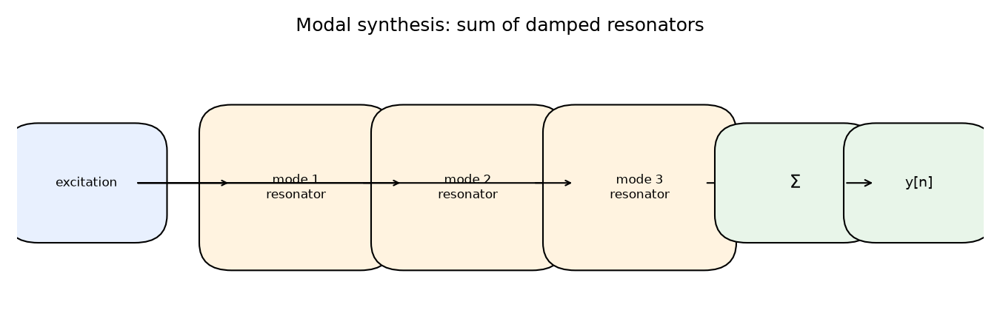
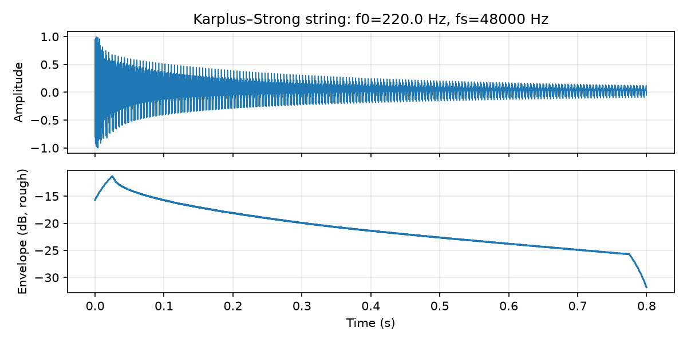

# Physical-Modeling Representations {#ch-19-physical-modeling}

## Purpose

**Physical modeling** simulates vibrating structures and acoustic coupling: strings, tubes,
membranes, excitations. Representations are often **partial differential equations** discretized
(FDTD, waveguides) or **compact resonator banks** (modal). This chapter orients readers to delay-
line/waveguide models and excitation–resonance–radiation framing.

## Representation lens

| Question | Physical-modeling answer |
|----------|-------------------------|
| **What is the representation?** | State of a vibrating system: traveling waves in delays, modal amplitudes, or grid displacements |
| **What does it preserve?** | Resonance frequencies, decay times, excitation transients tied to mechanics |
| **What does it discard?** | Non-mode energy, spatial radiation pattern detail (unless modeled), thermal drift |
| **Maps in/out via** | Excitation signal → resonator update → output sample; inverse problems need measurements + fitting |
| **Numerical mistakes** | Unstable loop gain; nonlinearities without oversampling; wrong delay length for pitch |
| **Audible artifacts** | Metallic ringing, pitch drift, aliased buzz on bow/reed nonlinearities |

## Learning Objectives

By the end of this chapter, the reader should be able to:

1. Sketch **excitation → resonator → radiation** pipeline
2. Explain **digital waveguide** string model (bi-directional delays + filters)
3. Contrast **lumped modal** vs **distributed waveguide** approaches
4. Relate **impedance** and boundary conditions to filter coefficients (conceptual)
5. Implement a minimal **Karplus–Strong** string and hear decaying pitch

## Main Concepts

### Excitation–resonance–radiation

**Excitation:** bow, pick, breath noise. **Resonator:** string/bore modes. **Radiation:** body
filter (often extra delay/FIR) [@smith2010physical]. Builds on delay lines ([Delay Lines, Comb
Filters, and All-Pass Filters](#ch-11-delay-comb-allpass)) and filters ([Filters: FIR, IIR, and the
Z-Transform](#ch-10-filters)).

### Digital waveguide string

Two delay lines (forward/backward traveling waves), loop filters for loss/dispersion, fractional
delay tuning:

$$
y^+[n] = \text{filter}\bigl(y^+[n-1], y^-\bigr), \quad \text{similar for } y^-.
$$

Output sum at bridge/end point. **Karplus–Strong** is the minimal closed-loop waveguide: one delay
of length $N \approx f_s/f_0$ with a low-pass in the feedback path.

### Waveguide acoustic tube (wind)

Cylindrical bore sections as delays; junctions as scattering matrices (Kelly–Lochbaum); reed/lip
excitation nonlinear.

### Modal synthesis

Sum of damped sinusoids:

$$
y[n] = \sum_k r_k^n \sin(\Omega_k n + \phi_k)
$$

or parallel second-order resonators— efficient for struck objects (bars, bowls). **Preserves** mode
frequencies and decays; **discards** spatial geometry unless modes are measured per instrument.

### Finite difference (FDTD)

Discretize wave equation on grid— flexible geometry, higher CPU; stability requires Courant
condition $\Delta t \le \Delta x / c$.

### Nonlinearities

Bow friction, reed threshold, valve— make model expressive; complicate analysis and aliasing control
([Sampling, Quantization, and Digital Audio](#ch-03-sampling-quantization)).

## Mathematical Formulation

1D wave equation:

$$
\frac{\partial^2 u}{\partial t^2} = c^2 \frac{\partial^2 u}{\partial x^2}.
$$

Discrete traveling-wave decomposition $u = y^+ + y^-$ motivates waveguides.

**Karplus–Strong update** (length $N$ buffer):

$$
y[n] = x[n-N], \quad x[n] = g \cdot \tfrac{1}{2}\bigl(x[n-1] + x[n]\bigr)
$$

with gain $g \in (0,1)$ controlling decay.

## Audio Interpretation

**Plucked string:** burst excitation + decaying harmonics with inharmonicity optional.

**Brass:** bore resonances + lip buzz; bore length sets pitch.

**Percussion plate:** dense modal partials with inharmonic ratios.

## Implementation Notes



The book ships `audio_toolkit.effects.karplus_strong`— a minimal plucked-string loop you can hear
and plot:

```bash
python examples/karplus_strong_demo.py
```

Start with Smith's `stk` or Julius O. Smith tutorials for full waveguide primitives. Modal: design
bank of biquads from measured partial frequencies/decays.

```python
from audio_toolkit.effects import karplus_strong

fs = 48_000
y = karplus_strong(fs, f0=220.0, duration_s=0.8, decay=0.995)
```



## Worked Example

**Problem:** String delay line round-trip $N=200$ samples at $f_s=48000$. Fundamental approximately?

**Answer:** Period in samples $\approx N$ gives $f_0 \approx f_s/N = 240$ Hz. Exact tuning uses
dispersion filters and fractional delay ([Resampling, Interpolation, and Sample-Rate
Conversion](#ch-14-resampling)).

**Problem:** Run Karplus–Strong at $f_0=220$ Hz. Does energy decay?

**Answer:** Yes— loop gain $g<1$ dissipates energy each trip; envelope falls (see demo plot). Wrong
$g\ge 1$ blows up or sustains forever (unphysical).

## Common Pitfalls

1. **Unstable loop gain** in waveguide filters.
2. **Aliasing from nonlinear excitation** without oversampling.
3. **Tuning drift** with temperature simulated poorly (dispersion error).
4. **Confusing physical units** in FDTD ($c$, grid spacing).

## Exercises

1. Draw waveguide string block diagram with loop filter.
2. Modal: three partials at 400, 1020, 1840 Hz with different decays— describe timbre.
3. Why fractional delay needed for accurate pitch? ([Resampling, Interpolation, and Sample-Rate
Conversion](#ch-14-resampling))
4. Compare CPU: 10-modal vs 1-waveguide string note.
5. Modify `karplus_strong_demo.py` decay; listen for shorter/longer ring-off.

*Selected solutions: [Appendix — Exercise Solutions](#ch-23-exercise-solutions).*

## Further Reading

- Smith, *Physical Audio Signal Processing* [@smith2010physical]
- Roads [@roads1996computer]

**Next chapter:** [Neural Audio Representations](#ch-20-neural-audio).
