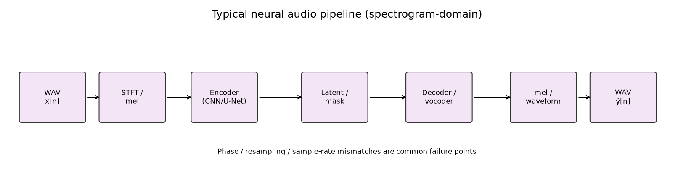
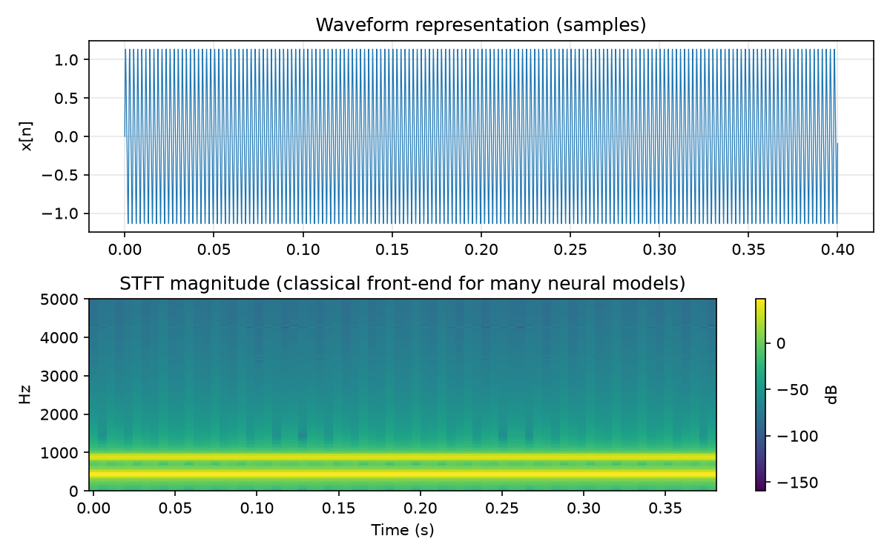

# Neural Audio Representations {#ch-20-neural-audio}

## Purpose

Deep learning adds **learned representations**: encoder networks map waveforms or spectrograms to
embeddings; generative models synthesize in latent or spectral domains. This chapter situates neural
methods relative to classical DSP— when they replace, complement, or inherit STFT-based pipelines
([STFT, Spectrograms, and Time–Frequency Analysis](#ch-08-stft), [Audio Features and
Descriptors](#ch-15-features)).

## Representation lens

| Question | Neural audio answer |
|----------|---------------------|
| **What is the representation?** | Learned embeddings, mel maps, latent codes, or raw waveform samples |
| **What does it preserve?** | Training-distribution structure; perceptual similarity (if loss matches) |
| **What does it discard?** | Interpretability, exact phase, out-of-domain robustness |
| **Maps in/out via** | Encoder $E_\theta$, decoder $D_\phi$; often STFT/mel as fixed front-end |
| **Numerical mistakes** | Train/serve sample-rate mismatch; mel config drift; ignoring phase |
| **Audible artifacts** | Metallic vocoder timbre; smeared transients; codec warble |

## Learning Objectives

By the end of this chapter, the reader should be able to:

1. Contrast **waveform**, **spectrogram**, and **learned latent** model inputs/outputs
2. Describe encoder–decoder and **VAE/autoencoder** embeddings for audio
3. Explain **differentiable STFT** layers bridging classical and neural views
4. Identify pitfalls: phase, aliasing in vocoders, dataset bias
5. Evaluate hybrid systems (neural enhancer + classical SRC)

## Main Concepts

### Representation choices

| Domain | Examples | Pros / cons |
|--------|----------|-------------|
| Waveform | WaveNet, SampleRNN | End-to-end; long receptive field costly |
| Spectrogram | U-Net vocoders, diffusion on mel | Leverages [STFT, Spectrograms, and Time–Frequency Analysis](#ch-08-stft) intuition; phase challenge |
| Latent | VAE, RVQ codecs (EnCodec) | Compact; may lose fine detail |
| Hybrid | DDSP [@engel2020ddsp], neural + sinusoidal | Interpretable partials + learned residuals |

### Classical front-end (still central)

Most neural pipelines **do not** ingest raw samples alone. A typical path:

```text
x[n]  →  STFT / mel  →  neural network  →  mel or waveform  →  vocoder / Griffin–Lim
```



Run the book's classical front-end demo (no PyTorch required):

```bash
python examples/spectrogram_frontend_demo.py
```



This shows what a **spectrogram-domain** model would see before learning.

### Learned features

CNN on log-mel → embedding for classification/tagging— replaces hand-crafted MFCCs ([Audio Features
and Descriptors](#ch-15-features)) when data abundant; still needs careful STFT front-end often.

### Generative audio

**GAN vocoders, diffusion, autoregressive** models generate mel or waveform. **Griffin–Lim**-class
phase estimation largely superseded but phase remains issue in naive pipelines.

### Differentiable DSP

STFT/ISTFT inside network (torchaudio, nnAudio)— gradients flow to analysis parameters; risk of
committing same window/leakage mistakes as classical chain ([Windowing, Leakage, and
Resolution](#ch-07-windowing)).

### Codecs as representations

Neural codecs (Lyra, EnCodec, DAC) learn discrete codes for low-bitrate speech/music— representation
for transmission and ML.

## Mathematical Formulation

Autoencoder:

$$
\mathbf{z} = E_\theta(x), \quad \hat{x} = D_\phi(\mathbf{z}), \quad \mathcal{L} = \|x-\hat{x}\|^2 +
\lambda \|\mathbf{z}\|_1 \ldots
$$

Mel loss common: $\|\text{Mel}(x)-\text{Mel}(\hat{x})\|_1$— perceptually weighted but incomplete.

## Audio Interpretation

**Source separation (Demucs):** time-domain U-Net learns masks— classical STFT mask learning
related.

**Voice conversion:** content embedding + pitch + timbre disentanglement (idealized).

**Style transfer on timbre:** swap embeddings while preserving F0 contour (hard).

## Implementation Notes

Optional PyTorch mel layer:

```python
import torchaudio
spec = torchaudio.transforms.MelSpectrogram(sample_rate=fs, n_fft=1024)
```

Book-native alternative: `audio_toolkit.spectral.stft` for numpy workflows and tests.

Reproducibility: fix weights, sample rate, mel config; report SI-SDR, PESQ, listening tests
([Testing, Measurement, and Numerical Pitfalls](#ch-21-testing-pitfalls)).

## Worked Example

**Problem:** Model trains on 16 kHz mono log-mel. Deploy on 48 kHz stereo field recording— what
breaks?

**Answer:** Bandwidth/sample rate mismatch, channel layout, noise domain shift; need resample/mono
policy and likely fine-tune.

**Problem:** Why keep explicit $f_0$ in DDSP-style hybrids?

**Answer:** Pitch is **structurally important** in music/speech; learned latents often smear $f_0$
unless constrained. DDSP keeps sinusoidal parameters interpretable and reduces vocoder burden.

## Common Pitfalls

1. **Training on mel, inferring waveform** without strong vocoder.
2. **Ignoring causal latency** for real-time models.
3. **Overfitting small datasets** with huge models.
4. **Treating embeddings as perceptually linear** without validation.

## Exercises

1. Sketch pipeline: WAV → mel → U-Net → mel → Griffin–Lim → WAV; list failure modes.
2. Why DDSP keeps explicit $f_0$ control?
3. Compare param count: MFCC+SVM vs small CNN on same task (conceptual).
4. When is classical STFT feature pipeline ([Audio Features and Descriptors](#ch-15-features)) still
preferable?

*Selected solutions: [Appendix — Exercise Solutions](#ch-23-exercise-solutions).*

## Further Reading

- van den Oord et al., WaveNet generative raw audio [@oord2016wavenet]
- Engel et al., differentiable DSP synthesis [@engel2020ddsp]
- Smith + STFT differentiable layers cross-ref [@smith2011spectral]

**Next chapter:** [Testing, Measurement, and Numerical Pitfalls](#ch-21-testing-pitfalls).
