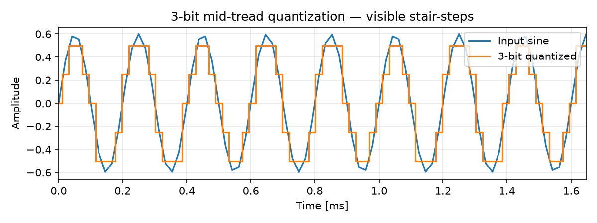
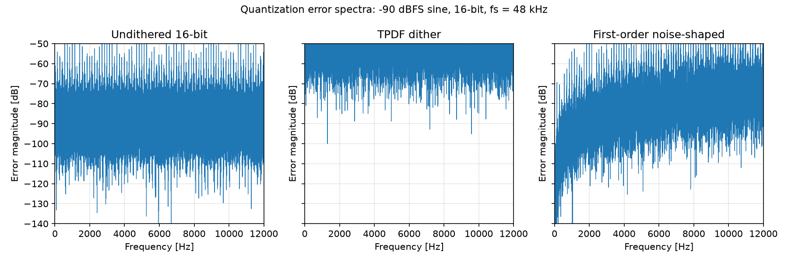

# Quantization, Dither, and Noise Shaping {#ch-24-quantization-dither}

## Purpose

Quantization is not just a theoretical limit. It is the reason a fade can become gritty, why low-
level tones can produce harmonic distortion, why mastering engineers add dither before 16-bit
export, and why delta-sigma converters can achieve high audio-band resolution with a 1-bit or few-
bit quantizer. [Chapter 3](#ch-03-sampling-quantization) introduced uniform quantization and SQNR;
this chapter explains **when** quantization behaves like harmless noise, **when** it becomes audible
distortion, and how **dither** and **noise shaping** control the damage.

Quantization is often introduced as a harmless "noise floor," but that is only sometimes true. In
real audio systems, quantization can behave either like benign broadband hiss or like signal-
dependent distortion. The difference matters. A low-level fade can become gritty, a quiet sine can
produce harmonics, and a careless 24-bit-to-16-bit export can sound worse than expected. Dither and
noise shaping are not decorative mastering tricks; they are ways of controlling the statistical and
spectral character of unavoidable numerical error.

## Representation lens

| Question | Quantization / dither answer |
|----------|------------------------------|
| **What is the representation?** | Finite-precision PCM codes, fixed-point words, or float significands |
| **What does it preserve?** | Amplitude within step size $\Delta$; dynamic range per bit depth or format |
| **What does it discard?** | Sub-quantum detail; information below the noise floor |
| **Maps in/out via** | Quantize / dequantize; float↔int conversion; dither injection |
| **Numerical mistakes** | Truncation instead of rounding; dither after limiter; repeated int round-trips |
| **Audible artifacts** | Harmonic distortion, gritty fades, limit cycles, granular noise on tails |

## Learning Objectives

By the end of this chapter, the reader should be able to:

1. Distinguish when quantization error behaves like **noise** vs **signal-dependent distortion**
2. State the **classical quantization model**, its assumptions, and when SQNR formulas fail
3. Explain **dither** (RPDF, TPDF, noise-shaped) and the tradeoff it makes
4. Sketch a **first-order noise shaper** and explain why it does not reduce total noise
5. Compare **fixed-point Q-format** vs **IEEE float** in real audio pipelines
6. Apply **format-conversion rules** (clipping, scaling, dither, rounding) for PCM export

## Main Concepts

### Why quantization matters in audio

Every finite numerical representation quantizes values. PCM files, fixed-point DSP chips, floating-
point plugin buffers, coefficient storage, lookup tables, and accumulators all introduce finite-
precision effects. The symptoms show up in recognizable ways:

- A **fade-out** becomes gritty or buzzy as the signal rides fewer and fewer quantization steps.
- A **quiet sine wave** at very low level produces **harmonics** instead of a clean tone.
- A **24-bit mix** sounds worse than expected after careless export to 16-bit PCM.
- A **plugin** clips internally even though the input meter reads below 0 dBFS.
- A **fixed-point filter** explodes, becomes noisy, or sustains a **limit cycle** at zero input.
- A **delta-sigma converter** achieves excellent audio-band performance despite a coarse (even 1-
  bit) quantizer— a teaser for [AD/DA Conversion and Delta-Sigma](#ch-25-ad-da-conversion).
- A **float32 render** sounds fine, but the final **PCM export** still needs correct scaling,
  clipping, and dither.

The central idea of this chapter: **quantization error is not automatically white noise.** Dither
forces it to behave more like noise; noise shaping moves that noise to less harmful frequencies.

### Uniform quantization as a staircase

A **uniform quantizer** maps continuous amplitude to the nearest of a finite set of equally spaced
levels. [Chapter 3](#ch-03-sampling-quantization) introduced the mid-tread form:

$$
Q(x) = \Delta \left\lfloor \frac{x}{\Delta} + \frac{1}{2} \right\rfloor
$$

(round-to-nearest). **Quantization error** is $e[n] = Q(x[n]) - x[n]$.

Two common architectures differ at zero:

| Type | Zero behavior | Typical use |
|------|---------------|-------------|
| **Mid-tread** | Reconstruction level at zero | Signed audio PCM |
| **Mid-riser** | Threshold at zero; no level exactly at zero | Some unsigned ADC codes |

Mid-tread is standard for signed audio because small bipolar signals cross zero naturally.

Other implementation choices matter:

- **Rounding** vs **floor/truncation** — truncation biases error negative; rounding is symmetric.
- **Clipping (overload)** — input exceeds representable range; error is no longer bounded by
  $\pm\Delta/2$.
- **Saturation** vs **wraparound** — embedded DSP may saturate at max/min or wrap (the latter
  sounds catastrophic in audio).

For $B$-bit signed PCM on $[-1, 1)$, step size is $\Delta = 2/2^B$. The positive peak is
$+2^{B-1}-1$ codes and the negative minimum is $-2^{B-1}$ codes— slight asymmetry in int16
(+32767 / −32768).


At very low bit depth, the stair-step character is visible on a sine wave:



### When quantization error behaves like noise

Engineers often model quantization error as **white noise** uncorrelated with the signal, with
variance

$$
\sigma_e^2 = \frac{\Delta^2}{12}.
$$

This **classical model** is useful but conditional. It applies when:

- the signal spans **many** quantization steps,
- the error is approximately **uniformly distributed** over $[-\Delta/2, \Delta/2]$,
- the error is approximately **uncorrelated** with the signal,
- the quantizer is **not overloaded**,
- for the standard SQNR formula, the signal is a **full-scale sinusoid**.

Under these assumptions, each extra bit adds roughly $6\,\mathrm{dB}$ of signal-to-quantization-
noise ratio:

$$
\mathrm{SQNR} \approx 6.02\,B + 1.76\ \mathrm{dB}.
$$

The derivation appears in [Mathematical Formulation](#mathematical-formulation) below. The key
point: this is a **model**, not a law of nature.

### When the model fails — noise vs. distortion

The most important conceptual distinction in this chapter:

- **Random noise** is usually benign and perceptually tolerable.
- **Correlated error** is signal-dependent and sounds like **distortion** — tones, harmonics,
  buzz, or modulation of the noise floor.

Without dither, quantization error can lock to the signal. The quantizer makes the same signal-
dependent mistake on every cycle. A low-level sine uses only a handful of levels; the error
becomes **periodic**, and its spectrum contains **harmonic lines** rather than broadband hiss.

The model fails badly for:

- **low-level tones** and **fades** (signal rides few steps),
- **DC** or **near-DC** signals,
- **slowly varying** envelopes,
- **undithered re-quantization** (e.g., 24-bit → 16-bit truncation),
- **deterministic test signals** that repeat the same quantization pattern.

**Dither** is the technique that breaks this correlation. It deliberately adds noise to **remove**
distortion. This is not a bug; it is a trade.

### Dither: trading distortion for noise

**Dither** is like shaking a ruler while measuring. Each individual measurement becomes noisier,
but the average behavior becomes more faithful. In audio, added randomness prevents the quantizer
from making the same signal-dependent mistake over and over.

Add wide-sense dither $d[n]$ before quantization:

$$
y[n] = Q(x[n] + d[n]).
$$

**Subtractive dither:** add known dither before quantization, subtract the **same** dither after.
Mostly theoretical or used in controlled systems where the dither sequence is stored.

**Non-subtractive dither:** add dither before quantization and **leave it in** the signal. This is
the common case in audio mastering and final PCM export.

| Dither type | Amplitude (peak-to-peak) | PDF | Practical effect |
|-------------|--------------------------|-----|------------------|
| RPDF (rectangular) | $1\,\mathrm{LSB}$ ($\pm\Delta/2$) | Uniform | Decorrelates first moment; can leave some modulation |
| TPDF (triangular) | $2\,\mathrm{LSB}$ ($\pm\Delta$) | Triangular (sum of two RPDF) | Decorrelates second moment; standard for 16-bit export |
| Noise-shaped | filtered TPDF | Shaped | Moves dither + error energy to high frequencies |

**RPDF** can remove some bias-like artifacts. **TPDF** more robustly removes signal-dependent
distortion and modulation of the noise floor— the common safe choice for final word-length
reduction. TPDF is often produced by summing two independent uniform $\pm\Delta/2$ noises.

**When to dither:** at the **final** word-length reduction to integer PCM— not randomly throughout
the processing chain. Internal processing should stay in float; dither once on export.

### Noise shaping: moving noise where it hurts less

**Noise shaping is not magic.** It does not make quantization noise disappear. It **redistributes**
noise across frequency— trading low-frequency noise for high-frequency noise. This is useful only
if the high-frequency region is outside the band of interest or less audible.

In oversampled quantization loops (see [AD/DA Conversion and Delta-Sigma](#ch-25-ad-da-conversion)),
a noise-shaping filter $H(z)$ acts on the quantization error $E(z)$:

$$
Y(z) = X(z) + E(z)\,H(z).
$$

Choose $H(z)$ so $|H(e^{j\Omega})|$ is **small** in the audio band and **large** at high
frequencies. The **first-order** shaper

$$
H(z) = 1 - z^{-1}
$$

differentiates the error spectrum, pushing noise toward Nyquist. **Oversampling** provides extra
frequency space above the audio band where shaped noise can accumulate without landing in the
audible range— which is why noise shaping and oversampling often appear together.

A noise shaper is a **feedback system**; stability matters. Higher-order shapers can achieve more
aggressive shaping but are dangerous if poorly designed— they can become unstable or produce
audible tonal artifacts in the shaped noise.

Human hearing is more sensitive in some mid-frequency bands than at very high frequencies (see
[Audio Coding and Psychoacoustics](#ch-30-audio-coding) for critical bands and masking). Moving
quantization noise to the ultrasonic or high-frequency region can make it less objectionable— but
aggressive shaping can create energy that causes problems if the file is later filtered, resampled,
or played through a chain that is not strictly band-limited.

### Number formats in real DSP systems

Quantization is not only about file export. Every finite representation introduces error:

| Context | Common format | Why it matters |
|---------|---------------|----------------|
| WAV / CD delivery | int16 PCM | Final format; needs dither on reduction |
| High-resolution recording | int24 PCM | More headroom and noise margin |
| Plugin / DAW processing | float32 | Internal headroom; easy scaling |
| Offline mastering / summing | float32 / float64 | Long accumulations need precision |
| Embedded DSP | Q15 / Q31 fixed-point | Speed, determinism, limited dynamic range |
| Filter coefficients | float or fixed | Small coefficient errors affect response |

**Fixed-point** $Qm.n$ uses $m$ integer bits and $n$ fractional bits. Multiplication of two
$n$-bit fractional values produces a $2n$-bit product; implementations accumulate in a **wider
accumulator** and then truncate or round back. **Q-format** interpretation requires **scale
tracking** through a signal chain.

Fixed-point pitfalls:

- **Integer multiply bit growth** — products need wider words.
- **Accumulator width** — FIR/IIR sums can overflow without enough headroom.
- **Saturation vs wraparound** — saturation clips; wraparound creates bizarre tones.
- **Coefficient quantization** — rounding filter coefficients shifts poles/zeros.
- **Limit cycles** in IIR filters — quantized internal states can sustain small self-oscillations
  even at zero input ([Testing, Measurement, and Numerical Pitfalls](#ch-21-testing-pitfalls)).

**Floating-point** (IEEE 754) uses exponent + significand. float32 offers enormous dynamic range
but only about **24 bits of significand precision**. Quantization step size depends on **magnitude**:
adding a tiny value to a huge value may change nothing. float gives **headroom**, not automatically
more precision at every amplitude.

Float caveats for audio:

- Summing many samples or a long FIR may need **float64** or **compensated summation** (Kahan).
- **Denormals** near zero can cause CPU slowdowns in real-time systems; flush-to-zero is common.
- **Non-associative** parallel sums can differ slightly by reduction order.
- float can exceed **0 dBFS** internally; integer PCM cannot— clip or limit before final
  conversion ([Envelopes, Loudness, and Dynamics](#ch-13-envelopes-loudness)).

### Format conversion rules

Converting between formats is where many artifacts appear.

**float → int16** (normalized float in $[-1, 1]$):

```python
import numpy as np

def float_to_int16(x, dither=True):
    # Clip before quantize; positive max is +32767, negative min is -32768
    x = np.clip(x, -1.0, 1.0 - 1.0 / 32768)
    if dither:
        # TPDF: sum of two independent RPDF noises, peak-to-peak 1 LSB
        d = (np.random.rand(len(x)) - np.random.rand(len(x))) / 32768
        x = x + d
    return np.round(x * 32768).astype(np.int16)
```

Subtleties:

- **Clip before** integer conversion, not after.
- **Dither before** rounding/quantization.
- **Rounding** is better than truncation for symmetric error.
- Careless scaling creates **asymmetry** or unexpected clipping.
- **int → float** is exact for representable integers; repeated float→int→float round-trips
  without dither cause **granular distortion** on fades and reverb tails.

## Mathematical Formulation

### Full-scale conventions and dBFS

**dBFS** (decibels relative to full scale) references digital peak full scale. For a sine with
peak amplitude $A$ normalized to full scale ($A=1$), the RMS is

$$
P_\text{signal} = \frac{A^2}{2} = \frac{1}{2}.
$$

A tone at $-90\ \mathrm{dBFS}$ has RMS amplitude $10^{-90/20} \approx 0.0000316$ (about $-48$
dB below full-scale peak).

### Error variance $\Delta^2/12$

For a mid-tread quantizer with step $\Delta$ and error uniformly distributed over
$[-\Delta/2, \Delta/2]$:

$$
\sigma_e^2 = \int_{-\Delta/2}^{\Delta/2} e^2 \cdot \frac{1}{\Delta}\,de
= \frac{\Delta^2}{12}.
$$

### SQNR derivation

For a full-scale sinusoid ($A = 1$) and uncorrelated quantization noise:

$$
\mathrm{SQNR} = 10\log_{10}\frac{P_\text{signal}}{P_e}
= 10\log_{10}\frac{1/2}{\Delta^2/12}
= 10\log_{10}\frac{6}{\Delta^2}.
$$

For $B$-bit signed PCM, $\Delta = 2/2^B$, so $\Delta^2 = 4/2^{2B}$:

$$
\mathrm{SQNR} = 10\log_{10}\frac{6 \cdot 2^{2B}}{4}
= 10\log_{10}\left(1.5 \cdot 2^{2B}\right)
\approx 6.02\,B + 1.76\ \mathrm{dB}.
$$

The **+1.76 dB** term comes from using **RMS** of a full-scale sine ($1/\sqrt{2}$) rather than
peak. Memorizing $6.02B$ alone assumes peak-referenced signal power.

### Noise-shaping transfer function

In the additive model, shaped quantization noise at the output is $E_s(z) = E(z)\,H(z)$. For
$H(z) = 1 - z^{-1}$:

$$
|H(e^{j\Omega})| = |1 - e^{-j\Omega}| = 2\left|\sin\frac{\Omega}{2}\right|.
$$

Noise power is **reduced** where $|H|$ is small (low $\Omega$) and **increased** where $|H|$ is
large (near $\Omega = \pi$). Total noise power is conserved (or increased); it is **moved**, not
destroyed.

## Audio Interpretation

| Symptom | Likely cause | Mitigation |
|---------|--------------|------------|
| Harmonics on quiet tone | Undithered low-level quantization | TPDF dither at final export |
| Gritty fade / reverb tail | Granular distortion from truncation | Float processing; dither on PCM export |
| Idle tone in IIR at silence | Fixed-point limit cycle | Higher precision states; dither; saturate |
| Hiss increase after dither | Expected trade | Accept slight noise floor rise vs distortion |
| HF whistle after aggressive shaping | Shaped noise near Nyquist | Moderate shaping; avoid further processing |
| Plugin clips "internally" | float headroom exceeded in chain | Gain staging; limit before int export |

**Mastering:** process at 32- or 64-bit float; apply final peak/loudness limiting; add **TPDF
dither** (or noise-shaped dither for final delivery) once when reducing to 16-bit.

**Plugin development:** use float32 internally for headroom; never assume "below 0 dBFS" means no
clipping inside nonlinear or filter stages.

**Embedded DSP:** budget headroom in accumulators; use saturation arithmetic; verify IIR stability
with quantized coefficients.

## Implementation Notes

Run the quantization and dither comparison demo:

```bash
python examples/quantization_dither_demo.py
```

The script generates spectra of quantization error for a $-90\ \mathrm{dBFS}$ sine at 16-bit
depth— three cases: undithered, TPDF-dithered, and first-order noise-shaped.



**What to notice:** undithered quantization produces **harmonic lines** in the error spectrum
(distortion). TPDF dither replaces them with a raised **broadband noise floor**. Noise shaping
pushes that noise toward **high frequencies**, leaving the audio band cleaner.

### Uniform quantizer in Python

```python
def uniform_quantize(x, bits, full_scale=1.0):
    levels = 2 ** bits
    delta = 2 * full_scale / levels
    x_clip = np.clip(x, -full_scale, full_scale - delta / 2)
    return delta * np.round(x_clip / delta)
```

Compare peak, RMS, and spectrum of $x$ vs $Q(x)$ and $Q(x+d)-x$ to see distortion vs dithered
error.

## Worked Examples

### Example A: 3-bit quantization of a sine

A 3-bit signed quantizer on $[-1, 1)$ has $\Delta = 2/8 = 0.25$ and only eight levels. A sine at
moderate level visibly **stair-steps**. The error waveform is not random— it repeats with the signal
period, producing **harmonic distortion** in the spectrum. This is the same mechanism that affects
quiet 16-bit audio, just easier to see at 3 bits.

### Example B: −90 dBFS sine, 16-bit, no dither

A sine at $-90\ \mathrm{dBFS}$ has RMS $\approx 3.16 \times 10^{-5}$. With $\Delta = 2/65536
\approx 3.05 \times 10^{-5}$, the tone uses only a **few** quantization levels. The error is
periodic and **correlated** with the signal. In the error spectrum you hear (and see) **harmonic
lines**— not the $-96\ \mathrm{dB}$ broadband floor the classical model predicts.

### Example C: Same sine with TPDF dither

Adding TPDF dither before 16-bit quantization breaks the correlation. The harmonic lines **disappear**;
the error spectrum becomes **broadband** near the theoretical $-96\ \mathrm{dBFS}$ floor. The cost
is a slightly **raised noise floor**— the deliberate trade dither makes.

### Example D: Granular distortion on a fade

A reverb tail fading from $-40\ \mathrm{dBFS}$ to $-80\ \mathrm{dBFS}$, truncated repeatedly to
16-bit without dither, sounds **grainy** or **buzzy** as the signal hops between levels. Processing
in float and dithering only on the final export avoids this.

## Common Pitfalls

1. **Truncation vs rounding** — truncation biases error; use rounding for PCM export.
2. **Dither after limiter** — wrong order; limit/clip first, then dither, then quantize.
3. **Dithering multiple times** — raises noise floor unnecessarily; dither once at final reduction.
4. **Ignoring noise shaping** when analyzing $\Delta\Sigma$ ADCs ([Chapter 25](#ch-25-ad-da-conversion)).
5. **Assuming float32 is always enough** — long FIR accumulations and coefficient-sensitive IIR
   designs may need float64.
6. **Treating SQNR as measured SNR** — real converters add analog noise, distortion, and jitter.

### Practical checklist for audio export

- Keep **internal processing** in float32 or float64.
- Avoid **repeated int conversions** during processing.
- Maintain **headroom** in the mix; do not mix hot into the final quantizer.
- On final conversion to integer PCM, **scale correctly** and **clip/limit before** quantization.
- Add **dither only once**, at the final word-length reduction.
- Use **TPDF dither** for general-purpose 16-bit export.
- Use **noise-shaped dither** only when the file is **final delivery** and will not be heavily
  processed afterward.
- Do **not** dither when exporting float files.
- Do **not** add dither before lossy codecs unless you understand the codec interaction.

## Exercises

1. Compute SQNR for 8-, 16-, and 24-bit uniform quantizers using $6.02B + 1.76$ dB.
2. Why is triangular dither preferred over rectangular for critical 16-bit mastering?
3. Sketch $|1-e^{-j\Omega}|$ for $\Omega \in [0, \pi]$ and explain the auditory benefit of a
   first-order noise shaper.
4. When is float32 insufficient for long FIR accumulation? What mitigations exist?
5. A float mix peaks at $-3\ \mathrm{dBFS}$. Write the correct sequence of operations to export
   to 16-bit PCM with TPDF dither.
6. Explain why a fixed-point IIR filter can produce a limit cycle even when the input is zero.

*Selected solutions: [Appendix — Exercise Solutions](#ch-23-exercise-solutions).*

## Further Reading

- Lipshitz & Wannamaker, dither [@lipshitz1992dither]
- Oppenheim & Schafer [@oppenheim2010discrete]
- Zölzer, *DAFX* [@zoelzer2011dafx]

**Next chapter:** [AD/DA Conversion and Delta-Sigma](#ch-25-ad-da-conversion).
