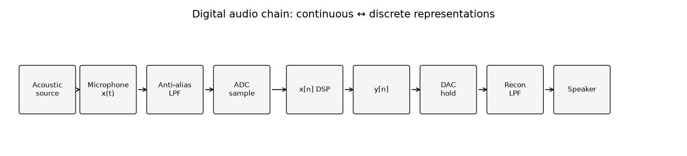

# AD/DA Conversion and Delta-Sigma {#ch-25-ad-da-conversion}

## Purpose

Digital audio begins and ends in **converters**. This chapter covers **Nyquist-rate** and
**oversampled** conversion, **delta-sigma ($\Delta\Sigma$)** noise shaping in ADCs/DACs, and
architectures (SAR, flash, R–2R, switched-capacitor) at the block-diagram level— enough to read
datasheets and design chains without analog VLSI detail.

## Learning Objectives

By the end of this chapter, the reader should be able to:

1. Contrast **Nyquist sampling** vs **oversampling** conversion strategies
2. Explain **$\Delta\Sigma$ modulation** and why in-band SNR improves with oversampling ratio
3. List key **ADC/DAC specifications** (ENOB, THD+N, DR, latency)
4. Sketch **SAR**, **flash**, and **$\Delta\Sigma$** ADC signal paths
5. Relate **DAC reconstruction** (hold, LPF) to images in [Resampling](#ch-14-resampling)

## Main Concepts

### Conversion methods

| Method | Idea | Typical use |
|--------|------|-------------|
| Nyquist-rate | Sample at $\ge 2B$ bandwidth | PCM interfaces |
| Oversampling | Sample faster, filter noise | $\Delta\Sigma$, class-D |
| $\Delta\Sigma$ | 1-bit + noise shaping | Consumer ADC/DAC, MEMS mics |

Oversampling spreads quantization noise; **decimation** filters it before output PCM
([Quantization, Dither, and Noise Shaping](#ch-24-quantization-dither)).

### ADC architectures

**Parallel (flash):** fastest, power-hungry— scope front ends.

**Successive approximation (SAR):** compare-and-refine; common 16–24 bit audio at moderate rates.

**Counter / integrating:** slow, precise DC— not music capture.

**$\Delta\Sigma$ ADC:** loop filter + 1-bit quantizer + feedback; high OSR yields 24-bit effective
in audio band.

Key specs: **ENOB** (effective bits from SINAD), **THD+N**, **dynamic range**, **group delay**
(lookahead for some digital filters).

### DAC architectures

**Switched voltage/current sources**, **weighted R/C ladders**, **R–2R networks** — ladder
topologies set analog step size.

**$\Delta\Sigma$ DAC:** upsample → noise-shaped 1-bit stream → analog low-pass (often class-D
friendly).

Reconstruction **images** at multiples of $f_s$ require analog or digital **sinx/x** compensation
([Sampling, Quantization, and Digital Audio](#ch-03-sampling-quantization)).



Run `python examples/adc_dac_diagram.py` to regenerate the chain figure.

### Oversampling and quantization demo

```bash
python examples/oversampling_quantization_demo.py
```

Compares Nyquist-rate 4-bit PCM vs 64× oversampled + first-order shaping for the same in-band SNR
target.

## Audio Interpretation

**Interface chips** (AES/EBU receivers) output PCM already decimated; **ADC choice** sets noise
floor for classical recordings. **DAC reconstruction filter** defines ultrasonic roll-off— affects
amp intermodulation if images leak.

## Common Pitfalls

1. **Confusing OSR with sample rate** on the wire (48 kHz PCM may come from 6 MHz $\Delta\Sigma$).
2. **Ignoring converter latency** in live monitoring paths.
3. **Measuring only THD** on tones— misses idle-channel hiss structure.

## Exercises

1. If OSR=64 and first-order shaping, approximate in-band SNR gain vs Nyquist PCM?
2. Why do many audio ADCs still expose 24-bit words when ENOB $\approx 20$?
3. Sketch SAR bit-trial loop for 3-bit example.
4. Where does anti-imaging occur in a $\Delta\Sigma$ DAC path?

## Further Reading

- Pohlmann, *Principles of Digital Audio* [@pohlmann2010principles]
- Schreier & Temes, $\Delta\Sigma$ converters [@schreier2004deltasigma]
- Smith [@smith2010physical]

**Next chapter:** [Audio Interfaces and Processing Systems](#ch-26-audio-interfaces).
